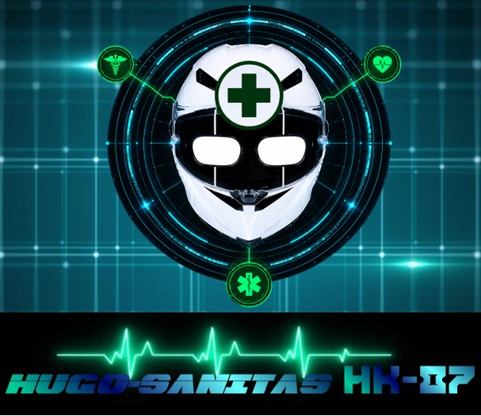
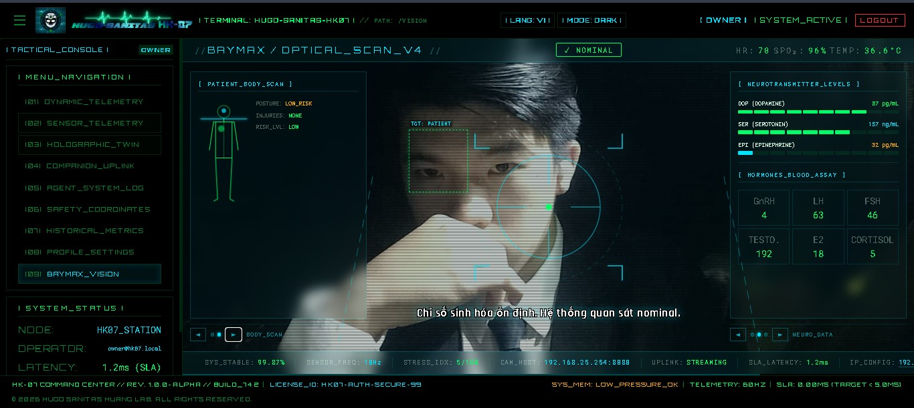
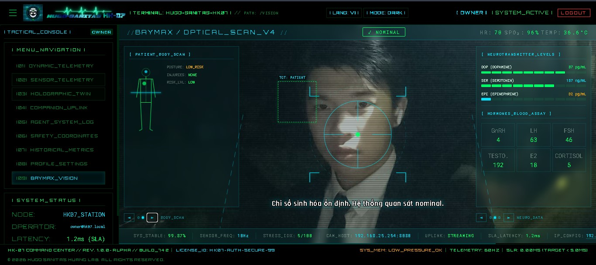
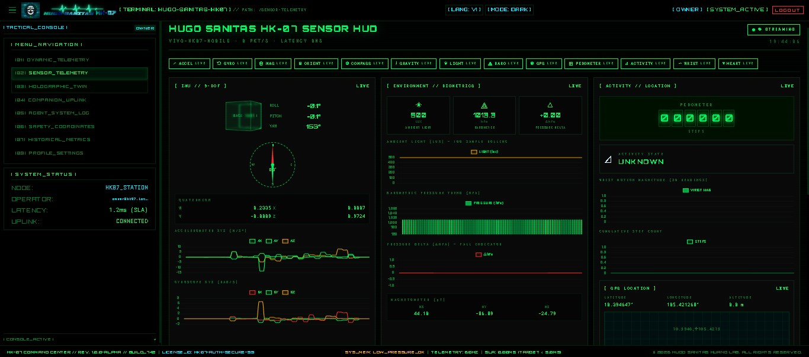
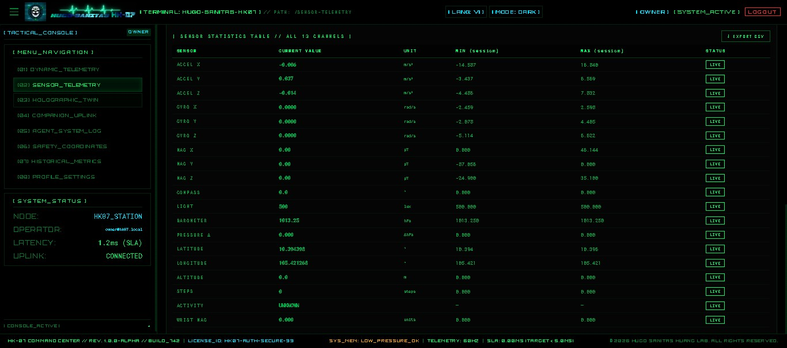
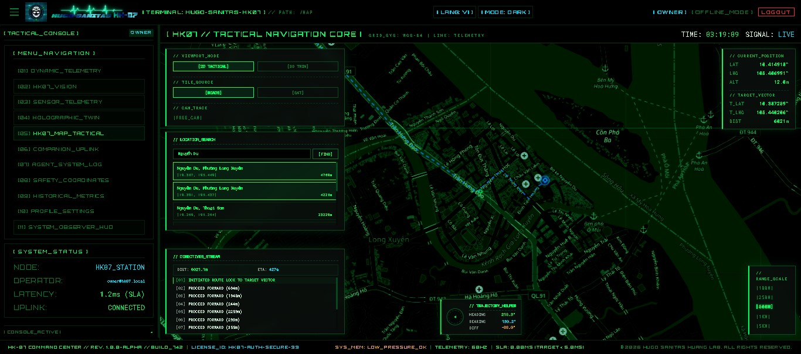
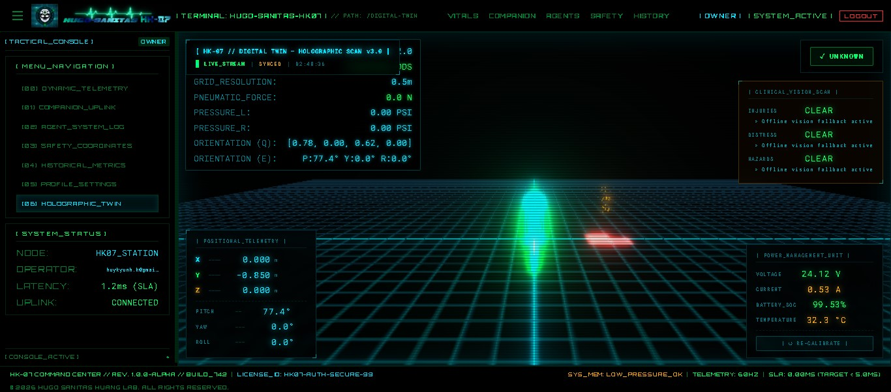
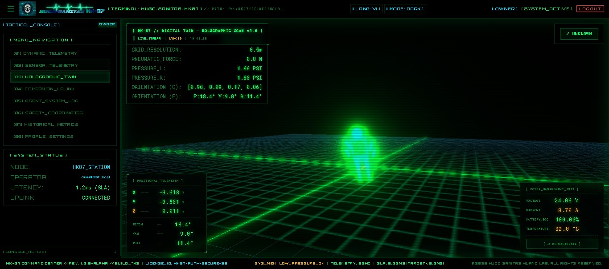

# ─── [ HUGO SANITAS HK-07 ROBOT COMPANION ] ───

<p align="center">
  
</p>

```
┌─────────────────────────────────────────────────────────────────────────┐
│  IDENTIFIER: HK.Huang07                │  VERSION: 1.0.0-BETA           │
│  INITIATED:  2026-05-31                │  STATUS:  OPERATIONAL          │
│  PLATFORM:   Linux / WSL2 / ROS2       │  THEME:   CYBER-CINEMATIC      │
└─────────────────────────────────────────────────────────────────────────┘
```

> **HK-07 // HUGO SANITAS** is a next-generation healthcare companion robot designed as a friendly companion that chats with and supports its owner as a friend, rather than acting as a clinical doctor or an emergency medical responder. The system integrates a high-performance **ROS 2 Humble** robotics core, multi-agent AI cognitive loops for empathetic companion dialogue, real-time vital signs telemetry for wellness check-ins, computer vision fall-detection, and a <5ms safety reflex system, operating efficiently under strict hardware constraints (<615MB RAM total).

---

## 🖥️ System Interface Showcase

The interface is built using a **Cyber-Cinematic HUD** design language (True Black `#000000` base, Holographic Cyan `#00E5FF` grids, Emerald Green `#00FF66` active telemetry, and Crimson `#FF3333` alarm warnings).

--- 

### 1. AI Cognitive & Agent Systems

#### A. Empathetic AI Companion Dialogue & Voice UI

* **Description:** Empathetic dialogue interface powered by a Groq/Gemini/Local-SLM Multi-Agent loop. Features a **Continuous Background Audio Analysis** system via SensorLogs that semantically processes environmental voice streams without manual buttons, coupled with synthetic dual-language voice output (TTS) and an interactive **AGENT_COGNITIVE_SCOPE** status display. Includes real-time API integrations that fetch actual LLM runtime metrics (Provider, Model, Temperature).

#### B. Multi-Agent System Logs Event Stream & Blackboard

* **Description:** Real-time thought loops, decision-making logs, and shared Blackboard parameters from the `Vitals Monitor Agent`, `Emergency Agent`, `Empathetic Agent`, `Perception Agent`, and `Action Agent`.

---

### 2. Edge Vision & Environment Vitals Simulation

#### A. MediaPipe Face Tracking & Forehead ROI Extraction

* **Description:** Real-time facial landmarker tracking utilizing MediaPipe. Crops the forehead region dynamically to extract average green channel micro-fluctuations for Blood Volume Pulse (BVP) analysis.

#### B. Real-time Green-Channel FFT rPPG Heart Rate

* **Description:** Estimates heart rate remotely (rPPG) via a Fast Fourier Transform (FFT) on forehead green channel intensity history, presenting real-time physiological vitals with zero local simulation.

#### C. Resilient AI Fallback Client Console
* **Description:** Unified LLM Client console logs demonstrating active model rotation on 429 rate limits, auto-disabling of credit/quota exhausted API tiers (OpenRouter/OpenAI), and successful recovery to primary `meta-llama/llama-4-scout-17b-16e-instruct` vision completions.
 
---

### 3. HK-07 Simulated Sensor HUD & Telemetry Gateway

#### A. Simulated Sensor HUD Dashboard (13 Channels)

* **Description:** A dedicated sensor operations HUD. Displays real-time 9-DOF IMU data (3D cube rotation, compass dial, accelerometer/gyroscope/magnetometer line charts), environmental variables (light lux, barometric pressure), and user activity metrics (pedometer step count, movement states, wrist magnitude). Features a strict logical inference engine that dynamically labels sensor channels as `SIMULATED` (derived via computer vision or alternative IMU data) or `OFFLINE` (hardware unsupported), completely eliminating mock data rendering.

#### B. Live Sensor Channels & CSV Exporting

* **Description:** Real-time 13-channel system telemetry monitor. Displays current sensor states, dynamic session min/max tracking, status indicators (OK / WARNING / DANGER), and a high-performance CSV exporter for medical data audit.

---
### 4. Tactical GIS Navigation & Pathfinding Viewport

* **Description:** A military-grade 2D graticule navigation map widget that supports:
  * **Localized Geocoding (Nominatim API):** Real-time address resolution restricted strictly to Vietnam boundaries. Includes local search intercepts for quick regional targets .
  * **Shortest Path Road Routing (OSRM API):** Calculates actual road network coordinates and displays a scrollable step-by-step navigation maneuvers list.
  * **Dynamic Camera Control:** Operators can choose between `LKD_CENTER` (re-centering map tracking automatically onto the robot's coordinates) or `FREE_CAM` (manual map panning).
  * **Telemetry Integration:** Fully synchronized with the robot's real-time published GPS coordinates.
  * **Tactical Visuals:** Centered compass trajectory dial HUD overlay and high-contrast terminal cyber green map tile filters.

---

### 5. Robotics & Spatial Safety Systems

#### A. Three.js Holographic Twin & Occupancy Costmap



* **Description:** A virtual 3D wireframe radar showing the physical joint orientations, real-time kinematics, 3D LiDAR point cloud mapping, and custom APF-based collision avoidance vector arrows. Projecting LiDAR data onto a dynamic 2D costmap at floor level. Integrates synchronized fall state warnings.

#### B. Safety Coordinates & Motion Inhibition Control

* **Description:** Monitors LiDAR sensor ranges, coordinates, and triggers the hard reflex inhibition system to stop motors instantly if an obstacle or fall is detected.

---

### 5. Wellness Telemetry & Companion Health Monitoring

#### A. Dynamic Vitals Telemetry Monitor (60FPS)

* **Description:** The central operations cockpit. Renders live bio-metrics (Heart Rate, SpO2, Body Temperature, Blood Pressure) with a GPU-accelerated HTML5 Canvas displaying real-time 60Hz ECG waveforms.

#### B. Vitals History Timeline Analytics

* **Description:** Allows operators to customize historical search ranges (From Date / To Date) to load, plot, and analyze user physiological trends and companion telemetry.

---

### 6. Security & Authentication Access

#### A. Cinematic Terminal Login

* **Description:** A futuristic terminal-style authentication interface. Built to look like a medical/military operations control panel, prompting operators for secure system credentials.

#### B. Multi-Factor Authentication & Backup Code Verify

* **Description:** Fallback authentication using cryptographically secure Multi-Factor Authentication (MFA) backup codes when normal authenticator tokens are unavailable.

---

### 7. User Profile & Security Settings

#### A. Profile Configuration & MFA Controls

* **Description:** Management control panel containing user personal profiles, credentials, and active configuration of MFA keys.

---

## ⚙️ System Architecture

```
┌────────────────────────────────────────────────────────────────────────────────────────┐
│                        HK-07 HUGO SANITAS — SYSTEM ARCHITECTURE                        │
├───────────────────────┬─────────────────────────┬──────────────────────────────────────┤
│    [FRONTEND]         │     [BACKEND CORE]      │            [AGENT ENGINE]            │
│    Vue 3 + Vite       │    Spring Boot 3.2.5    │            Python FastAPI            │
│    Port: 3010         │     Java 21 VT          │            Port: 8889                │
│    Three.js 3D Twin   │     Port: 8888          │            Multi-Agent Loops         │
│    Voice UI (TTS/STT) │     JWT Auth & RBAC     │            Redis Blackboard          │
└──────────┬────────────┴────────────┬────────────┴──────────────────┬───────────────────┘
           │ WebSocket (9090)        │ WebSocket/REST                │ HTTP/REST
           │                         ▼                               │
           │           ┌─────────────────────────────┐               │
           │           │    [BACKEND CORE SERVICES]  │               │
           │           └─────┬──────────────┬────────┘               │
           │                 │              │                        │
           │                 ▼              ▼                        │
           │           ┌───────────┐  ┌───────────┐                  │
           │           │ MySQL 8.4 │  │   Redis   │◄─────────────────┤ (Blackboard)
           │           │   :3306   │  │   :6379   │                  │
           │           └───────────┘  └─────▲─────┘                  │
           │                                │                        │
           │                                │                        ▼
           │                                │          ┌────────────────────────────┐
           │                                └─────────►│     Eclipse Mosquitto      │
           │                                           │     MQTT Broker :1883      │
           │                                           └─────────────▲──────────────┘
           │                                                         │
           │                                                         │ MQTT / ROS2 Bridge
           ▼                                                         ▼
┌────────────────────────────────────────────────────────────────────────────────────────┐
│                              ROS 2 HUMBLE ROBOTICS CORE                                │
│  - balance_controller (Stance PID)         - navigation_agent (APF Path Planner)       │
│  - hugo_telemetry_sim (State Simulator)    - rppg_thermal_node (rPPG Face & Thermal)   │
│  - hk07_physics_node (IK Solver)           - rtos_watchdog_simulator (Watchdog)        │
│  - perception_bridge_node (Gateway Bridge) - sensor_fusion_node (MediaPipe Vision)     │
│  - action_controller_node (Execution Node) - rosbridge_server (Port 9090 WebSocket)    │
└────────────────────────────────────────────────────────────────────────────────────────┘
```

---

## 🛠️ Practical Problems Solved

1. **Emergency Reflex Latency (<5ms):** Bypasses standard database persistence blocks to execute critical safety scripts (e.g. stopping motors upon collision threat or triggering medical alarms) utilizing optimized MQTT pipelines.
2. **Resource Constraints Optimization:** Runs a full suite of services (Spring Boot, Python Agents, databases, and message brokers) comfortably on host systems with limited resources, budgeting total memory usage to **<615MB RAM**.
3. **Hybrid Diagnostic System (Blackboard):** Implements a two-layer control system. A *Hard Reflex Layer* executes static safety threshold rules to trigger immediate alerts, while a *Soft Cognitive Layer* leverages AI Agents, LLMs, and a shared Redis Blackboard for contextual health evaluation and comforting friendly communication.
4. **Secured Real-Time Telemetry:** Secures live health streams over WebSockets via a JWT Inbound Channel Interceptor on STOMP, ensuring that only authenticated users can access real-time medical data.
5. **DDS to MQTT Bridging:** Standardizes robotics messages to ROS 2 types (`sensor_msgs/Imu`, `sensor_msgs/PointCloud2`, `sensor_msgs/JointState`, `geometry_msgs/Twist`) and seamlessly bridges them to the lightweight MQTT broker for lightweight streaming to NUI dashboard components.
6. **Local Edge Fallback Autonomy:** Features a Vietnamese-optimized rule-based backup and local GGUF SLM execution (`llama-cpp-python` supporting Phi-3/Llama-3 templates) to maintain agent capabilities and query routing without an internet connection.
7. **Clinical EHR Standardization:** Implements a FHIR Gateway translating Blackboard clinical diagnoses and vital signals into HL7 FHIR Observation and Condition bundles.
8. **Watchdog Heartbeat Fail-Safe:** An ESP32 watchdog simulator monitors system heartbeats and triggers safety motor-inhibition and suit deflation if communication is lost for more than 3 seconds.
9. **Dual-Factor Fall Detection:** Fuses physical accelerometer impact/weightlessness thresholds with barometric altimeter pressure drops to significantly reduce false positive fall alerts from standard wrist movement.
10. **Dynamic Mobile Sensor Integration:** Translates raw mobile device telemetry (GPS, IMU, Pedometer, Light, Air Pressure) through an auto-configuring hotspot gateway bridge, routing high-frequency packets to the dashboard via a non-blocking virtual thread processor.

---

## 📦 Directory Structure

```
hk-07/
├── asset/                  ← System screenshots and UI graphics
├── docs/                   ← System architecture specifications and UI/UX design concepts
│   ├── 00_init/            ← Project scope, requirements, and techstack setup
│   ├── 01_system_design/   ← Architecture, database schemas, and API specs
│   ├── 02_subsystems/      ← Subsystem details (Backend, Deployment, Frontend, Testing)
│   ├── 03_evolution_specs/ ← Upgrade specifications and post-mortems (Phases 1-22)
│   ├── 04_walkthroughs/    ← Walkthrough guides of key implemented phases
│   ├── MASTER_CHANGELOG.md ← Entire project version history and audit log
│   ├── ROBOT_INTELLIGENCE_SPEC.md ← Specifications for multi-agent loops and safety subsumption
│   └── ROS2_UNIFIED_INTEGRATION.md ← Specifications for ROS 2 node consolidation and bridges
└── source/                 ← Target codebases
    ├── backend/
    │   ├── hk07-core/      ← Java Spring Boot core service (MySQL 8.4, WebSocket/STOMP, Flyway)
    │   ├── hk07-agent/     ← Python AI Multi-Agent service (Subsumption agents, Redis Blackboard, LanceDB)
    │   ├── docker/         ← Mosquitto MQTT broker configuration profiles
    │   └── docker-compose.yml ← Infrastructure composition (MySQL, Redis, Mosquitto, Ollama)
    ├── frontend/
    │   └── hk07-dashboard/ ← Vue 3 Operator Dashboard (Three.js 3D Twin, Chart.js, StompJS, Voice UI)
    ├── gitops/             ← Deployment scripts, environments setup, and network configs
    │   ├── clean-env.bat   ← Cleans transient network/host configurations
    │   ├── devmode.ps1     ← Launches the stack in Developer Mode
    │   ├── production.ps1  ← Launches the stack in Production Mode
    │   └── setup_network.bat ← Automates local networking & IP discovery bridges
    └── robotics/           ← ROS 2 Workspace
        ├── sensors/        ← Consolidated Sensors package (balance, telemetry, physics, navigation, vision)
        │   ├── mobile_gateway/ ← vivo_http_mqtt_bridge HTTP-to-MQTT telemetry bridge
        │   ├── simulation/ ← Simulated nodes (telemetry, kinematics, watchdog, APF planner)
        │   └── vision_sensor/ ← MediaPipe forehead tracking & rPPG sensor fusion
        ├── build/          ← ROS 2 intermediate build files (local compilation)
        └── install/        ← ROS 2 setup and environment scripts
```

---

## 🚀 Quick Start Guide

The system supports two operating modes: **Docker Orchestration** (fully integrated) or **Component-by-Component Developer Mode**.

### 1. Docker Deployment Mode

Running the standard `docker compose up -d` command from the repository root directory exclusively launches the backing infrastructure services (MySQL on Port 3306, Redis on Port 6379, and Mosquitto Broker on Port 1883). This leaves application ports 8888 and 8889 unoccupied so that you can run `hk07-core` and `hk07-agent` locally in terminal windows for active development and debugging.

To run the fully containerized end-to-end operational production stack in Docker, you must pass the `--profile operation` flag:
```bash
# 1. Copy environment template
cp source/backend/.env.example source/backend/.env
# Fill in your GROQ_API_KEY, GEMINI_API_KEY, or OPENROUTER_API_KEY inside the source/backend/.env file

# 2. Spin up the entire system including application services
docker compose --profile operation up -d --build

# 3. Access endpoints
# Frontend Dashboard:  http://localhost:4205 (Nginx Reverse Proxy)
# Backend Swagger Docs: http://localhost:8888/swagger-ui.html
# AI Agent API Docs:   http://localhost:8889/docs
```

To run localized edge simulation scripts against the Docker cluster, set the appropriate host parameters and execute:
```bash
export MQTT_BROKER_HOST=localhost
export MQTT_BROKER_PORT=1883
export MQTT_USERNAME=hk07sim
export MQTT_PASSWORD=your_configured_mqtt_password

# Launch OpenCV & MediaPipe facial capture node
python source/robotics/sensors/vision_sensor/hk07_sensor_fusion.py
```

---

### 2. Local Developer Mode

Before running services locally, spin up the backing database and message broker infrastructure:
```powershell
# In PowerShell (Windows Host) from repository root:
./source/backend/run_backend.ps1
```

Once infrastructure is active, launch each subsystem in a dedicated terminal window using relative paths from the repository root (`hk-07/`):

* **[TERMINAL 1]: ROS2 Server Bridge (WSL2 Ubuntu Environment)**
  * **Purpose**: Establishes the primary WebSocket communication bridge network gateway operating on Port 9090. This node acts as the foundational translation layer enabling real-time bi-directional telemetry data synchronization between the ROS2 robotic domain, the Python Multi-Agent systems, and the user interface dashboard.
  * **Execution Path**: `source/robotics`
  * **Step-by-Step Commands**:
    ```bash
    cd source/robotics
    source /opt/ros/humble/setup.bash
    rm -rf ~/.ros/log/*
    ros2 launch rosbridge_server rosbridge_websocket_launch.xml
    ```

* **[TERMINAL 2]: hk07-core Middleware Backend (Windows Host CMD / PowerShell)**
  * **Purpose**: Launches the core Enterprise Java enterprise infrastructure engine powered by Spring Boot 3.2.5 running on Port 8888. This subsystem governs system authentication, coordinates persistent relational logging via the MySQL ledger, processes dynamic medical vital sign threshold mappings, and synchronizes real-time device configurations.
  * **Execution Path**: `source/backend/hk07-core`
  * **Step-by-Step Commands**:
    ```bash
    cd source/backend/hk07-core
    ./mvnw spring-boot:run
    ```

* **[TERMINAL 3]: hk07-agent Multi-Agent Cognitive Core (WSL2 Ubuntu Enviroment)**
  * **Purpose**: Activates the primary artificial intelligence decision-making engine built on FastAPI running on Port 8889. This component deploys the multi-layered Subsumption architecture (Tiers 0-2), spins up the async isolated watchdog heartbeats, handles query routing, and manages the shared Redis blackboard memory matrix.
  * **Execution Path**: `source/backend/hk07-agent`
  * **Step-by-Step Commands**:
    ```bash
    cd source/backend/hk07-agent
    python main.py
    ```

* **[TERMINAL 4]: ROS2 Sensors Orchestrator Node (WSL2 Ubuntu Environment)**
  * **Purpose**: Fires up the core consolidated robotics ingestion loop. This high-performance Python node captures raw high-frequency mobile sensor payloads from the network gateway, parses IMU quaternions, processes the non-contact rPPG facial video metrics, and computes Artificial Potential Field (APF) obstacle repulsion vectors.
  * **Execution Path**: `source/robotics`
  * **Step-by-Step Commands**:
    ```bash
    cd source/robotics
    source /opt/ros/humble/setup.bash
    colcon build --packages-select sensors --symlink-install
    source install/setup.bash
    ros2 run sensors hk07_runtime_orchestrator
    ```

* **[TERMINAL 5]: hk07-dashboard Operator Interface Frontend (Windows Host CMD)**
  * **Purpose**: Spins up the local Vite-powered single page application development server on Port 3010. This component renders the web operations cockpit, visualizes live 60Hz ECG canvas waveforms, maps spatial data via the Three.js 3D Holographic Twin, and deploys the Push-to-Talk Voice UI modules.
  * **Execution Path**: `source/frontend/hk07-dashboard`
  * **Step-by-Step Commands**:
    ```bash
    cd source/frontend/hk07-dashboard
    npm run dev
    ```

---

### 3. Dynamic Connectivity Endpoint Contracts

Point your diagnostic/mobile peripherals to the target addresses allocated by the network configuration automation scripts:
* **Mobile Device Target URL (SensorLogs Application)**: `http://<LAPTOP_WIFI_IP>:5005/data`
* **Edge Video Stream Input URL (IPWebCam Application)**: `http://<PHONE_HOTSPOT_IP>:8080/video`

---

## 💾 Hardware RAM Allocation Target

| Service Name | Limit (RAM) | Sub-System Responsibilities |
| :--- | :--- | :--- |
| **Mosquitto** | 32 MB | Real-time broker for sensor telemetry |
| **Redis** | 64 MB | Blackboard shared memory, token cache & rate limiter |
| **MySQL 8.4** | 256 MB | Relational medical logs & user info |
| **hk07-core** | 512 MB | Spring Boot core backend JVM |
| **hk07-agent** | 256 MB | Python multi-agent event loop & GGUF Local SLM |
| **TOTAL** | **~615 MB** | **Highly optimized for low-spec WSL2/Docker** |

---

## 👤 Author

* **Huỳnh Quốc Huy** (HK.Huang07)
* **Email:** [huykyunh.k@gmail.com](mailto:huykyunh.k@gmail.com)
* **GitHub:** [hkhuang07](https://github.com/hkhuang07)
* **LinkedIn:** [hkhuang07](https://www.linkedin.com/in/hkhuang07/)

---

## 📄 License

Proprietary / Closed Source — All Rights Reserved.

Copyright (c) 2026 HK.Huang07 (Hugo Sanitas Project).

This software and its associated documentation files are the sole and exclusive property of the author. Copying, modification, distribution, redistribution, publishing, or sublicensing in any form, source or binary, with or without modification, is strictly prohibited without the prior written consent of the copyright owner.
