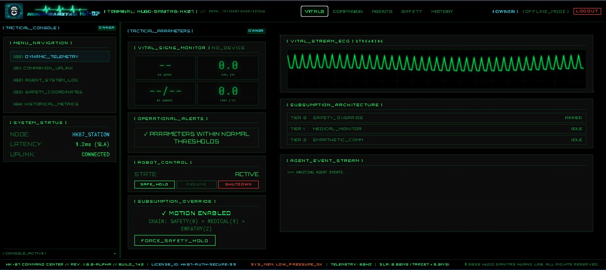
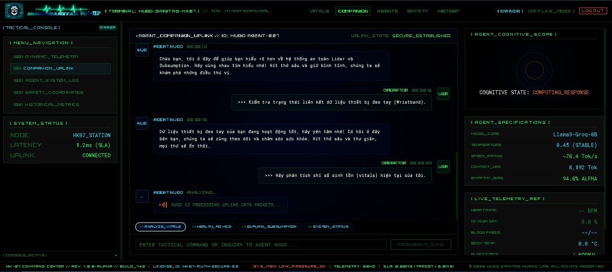
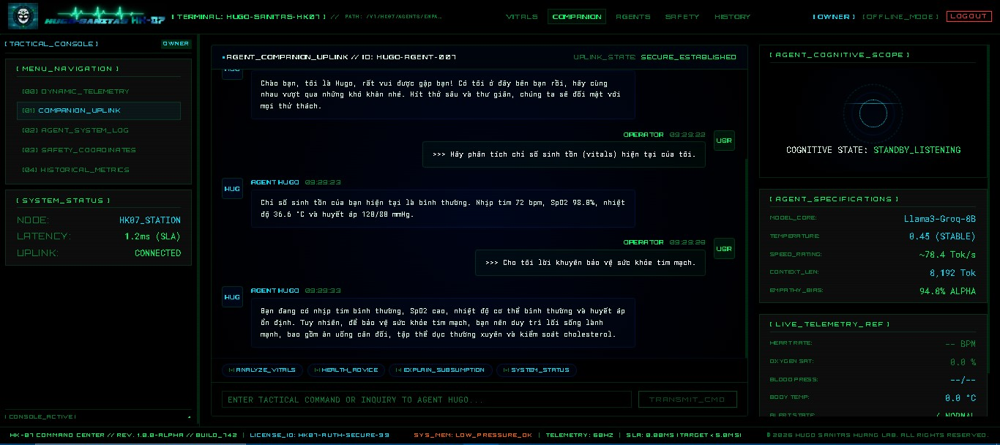
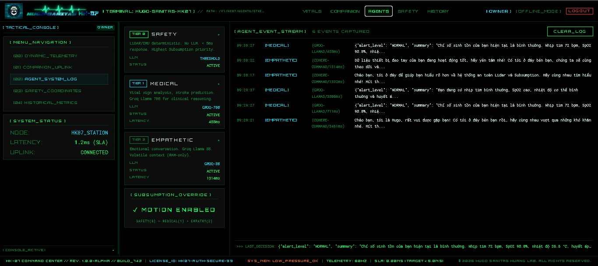
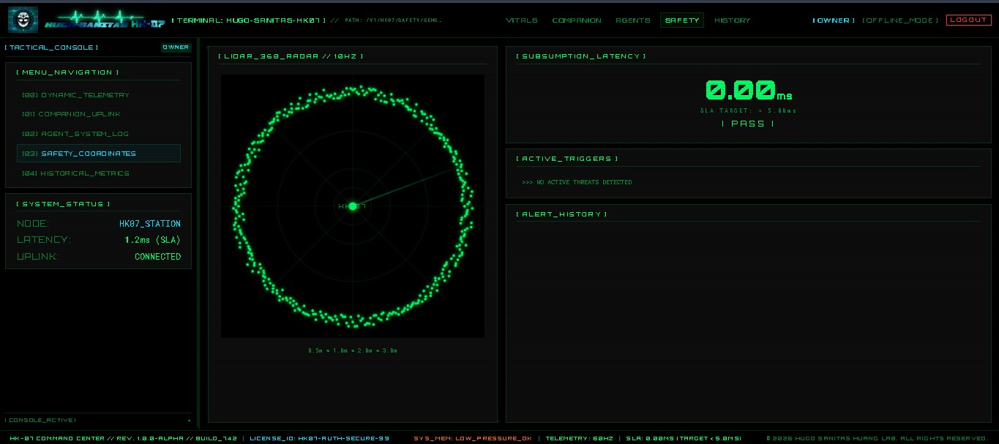
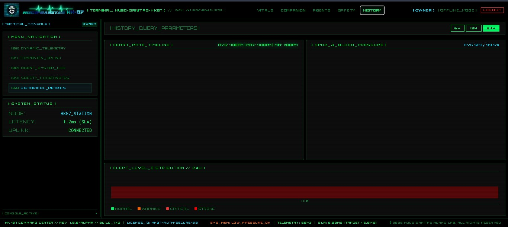
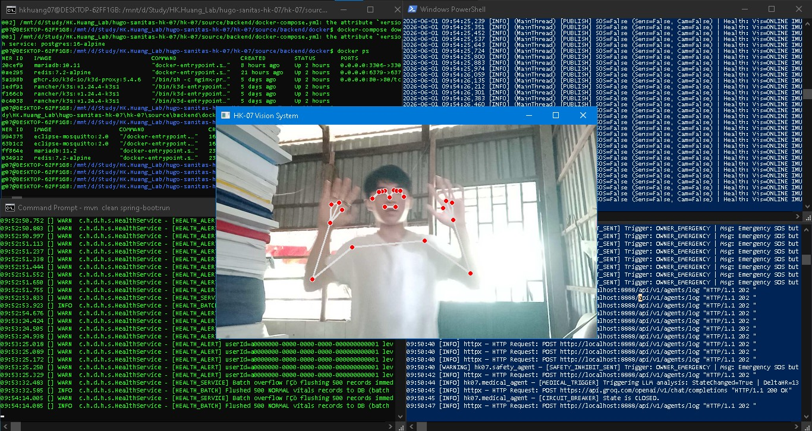

# HK-07 // HUGO SANITAS ROBOT COMPANION

<p align="center">
  
  &nbsp;&nbsp;&nbsp;&nbsp;&nbsp;&nbsp;&nbsp;&nbsp;
  
</p>

> **Identifier:** HK.Huang07 | **Version:** 1.0.0-ALPHA | **Initiated:** 2026-05-31

A next-generation healthcare robot companion — assisting in daily life through multi-agent artificial intelligence, real-time vitals monitoring, and <5ms emergency safety reflexes.

---

## System Interface Showcase

### 1. Vitals Dashboard Monitor (60FPS)


### 2. Empathetic AI Companion Chat & Reasoning



### 3. Multi-Agent System Logs (Agents Log)


### 4. Safety Control Coordination (Safety Radar)


### 5. Historical Vitals Metrics (History)


### 6. Robot Camera Simulation (Vision Stream Online / Offline)


### 7. Robot Computer Visualization


### 8. OpenCV & MediaPipe Computer Vision Processing



---

## System Architecture

```
┌─────────────────────────────────────────────────────────────┐
│         HK-07 HUGO SANITAS — SYSTEM ARCHITECTURE           │
├─────────────────┬───────────────────┬───────────────────────┤
│  [FRONTEND]     │   [BACKEND CORE]  │   [AGENT ENGINE]      │
│  Vue 3 + Vite   │  Spring Boot 3.2  │   Python FastAPI      │
│  Port: 5173     │   Java 21 VT      │   Port: 8889          │
│  Cyber-Dark UI  │   Port: 8888      │   3 Agent Loops       │
│                 │   JWT + RBAC      │   Groq/Gemini API     │
└────────┬────────┴────────┬──────────┴──────────┬────────────┘
         │  WebSocket/REST │   MQTT/WebSocket     │ MQTT
         ▼                 ▼                      ▼
┌────────────────┐  ┌─────────────┐  ┌───────────────────────┐
│   PostgreSQL   │  │    Redis    │  │  Eclipse Mosquitto    │
│   (Persist)    │  │  (Buffer)   │  │  MQTT Broker :1883    │
└────────────────┘  └─────────────┘  └───────────────────────┘
                                              ▲
                              ┌───────────────┴───────────────┐
                              │     SENSOR LAYER (Simulated)  │
                              │  Wokwi ESP32 (BLE Wristband)  │
                              │  ROS 2 LiDAR Mock Nodes       │
                              │  Webots Robot Simulator       │
                              └───────────────────────────────┘
```

---

## Mission & Resolved Problems

### 1. Project Mission (Mission & Philosophy)
The **HK-07 // HUGO SANITAS** project is designed to build an intelligent care-robot companion for the elderly and patients with cardiovascular conditions. The robot is not merely a passive vitals monitoring device but acts as an empathetic, fast-reacting interactive companion bridging patients, families, and medical staff.

### 2. Practical Problems Solved
* **Emergency Reflex Latency:** In medicine, every second counts. The system processes and reacts to critical health events (such as stroke detection, or stopping robot movement upon obstacle collision) in under 5ms using prioritized MQTT queues and STOMP WebSockets.
* **Hardware Resource Optimization:** The entire stack runs comfortably on resource-constrained embedded systems and legacy computers (e.g., Dell Latitude E7270 with a 1.6GHz CPU, 8GB RAM) with an extremely low memory footprint (<615MB RAM total).
* **Deterministic Rules & Empathetic AI Hybrid:** The system separates reflex responses into two layers: a Hard Reflex layer (triggering immediate SOS alerts based on fixed clinical thresholds) and a Soft Interaction layer (providing psychological comfort and secondary diagnostics using an LLM-powered Multi-Agent loop).
* **Secured Real-Time Telemetry:** Secures live health streams over WebSockets via a JWT Inbound Channel interceptor on STOMP, preventing unauthorized interception of sensitive medical telemetry.

---

## Tech Stack & Operational Workflow

### 1. Comprehensive Tech Stack
* **Frontend Dashboard:**
  * **Vue 3 + TypeScript + Vite:** High-performance SPA frontend.
  * **Pinia:** Synced state management for real-time vitals streams.
  * **Custom Cinematic Cyber-Dark Theme:** FUI (Fictional User Interface) aesthetic inspired by Big Hero 6 and Iron Man, featuring a Dark-Blue theme for professional operations monitoring.
  * **ECG Waveform Canvas:** GPU-accelerated HTML5 Canvas rendering a 60Hz real-time electrocardiogram wave.
* **Backend Core (Command Center):**
  * **Spring Boot 3.2 + Java 21 (Virtual Threads):** Thread-per-task concurrency model allowing thousands of concurrent WebSocket client connections with minimal CPU overhead.
  * **Spring Security + JWT:** Strict role-based access control (RBAC) supporting Owner, Medic, and Guest.
  * **STOMP Broker Interceptor:** Token-based security validation at the WebSocket connection layer.
* **AI Multi-Agent Engine (Cognitive Layer):**
  * **Python FastAPI:** Empathetic dialogue API and structured log forwarding.
  * **Multi-Agent Architecture:**
    * *Vitals Monitor Agent:* Tracks remote bio-metrics.
    * *Emergency Diagnostics Agent:* Clinical event detection.
    * *Empathetic Interactive Agent:* Natural conversation generator powered by Groq Llama 3 / Gemini Pro APIs for healthcare interactions.
* **IoT & Simulation (Hardware Layer):**
  * **Eclipse Mosquitto (MQTT Broker):** Ultra-low latency (<5ms) publish-subscribe message broker.
  * **Simulated ESP32 (Wokwi BLE Wristband):** Simulated smart band emitting heart rate, SpO2, body temperature, and an SOS panic button.
  * **Webots Simulator & ROS 2 Mock Nodes:** Physics-based simulation of the HK-07 robot chassis, distance sensors, and LiDAR obstacle avoidance.
* **Database:**
  * **MariaDB:** Relational database storing patient history, logs, and user metadata.
  * **Redis:** In-memory caching, WebSocket session management, and rate-limiting (throttling).

### 2. Operational Workflow
```
[BLE Wristband / Robot Sensors]
          │ (10Hz telemetry via MQTT)
          ▼
[Eclipse Mosquitto (Port: 1883)]
    ├───► [Python Multi-Agent Engine (Port: 8889)] ───► AI Reasoning & LLM Diagnosis
    └───► [Spring Boot Backend Core (Port: 8888)]
               │ (Priority handling, Database storage)
               ▼ (WebSocket STOMP via JWT Interceptor)
         [Vue 3 Frontend Dashboard (60FPS ECG)]
```

* **Step 1: IoT Ingestion:** The smart band simulator publishes JSON packets to `hk07/sensors/wristband/...` while the Webots robot emits obstacle distance metrics to `hk07/sensors/lidar/...`.
* **Step 2: Routing & Reflex Loop:**
  * Spring Boot Core intercepts the MQTT packets. If metrics fall within normal ranges, it persists them in MariaDB and broadcasts them instantly to the Vue 3 Dashboard via STOMP WebSockets.
  * If vitals exceed clinical thresholds (e.g. Heart Rate > 150 BPM - Heart Attack), the backend skips standard buffers, flags the event as an EMERGENCY, sends a command via MQTT to immediately halt the Webots robot, and triggers an overlay SOS modal on the frontend dashboard.
* **Step 3: Empathetic AI Dialogue:** The Python AI Agent catches the health event, reviews the patient's historical records, and calls the Groq/Gemini APIs to generate clinical advice and supportive dialogue, instantly routing it to the companion chat widget in the Vue 3 dashboard.

---

## Directory Structure

```
source/
├── backend/
│   ├── hk07-core/          ← Spring Boot (Java 21 Virtual Threads)
│   ├── hk07-agent/         ← Python Multi-Agent Engine (FastAPI)
│   └── docker/             ← Mosquitto + PostgreSQL configs
├── frontend/
│   └── hk07-dashboard/     ← Vue 3 + Vite Cyber-Cinematic UI
└── docker-compose.yml      ← Full stack (RAM budget: ~615MB)
```

---

## Quick Start & Testing Guide

The system supports two operating modes: **Full Docker Stack** (highly integrated services) or **Local Dev** (manually starting each system component).

### 1. Docker Deployment Mode (Docker Stack)
In this mode, all key databases, message brokers, core APIs, and AI agent services run containerized.

```bash
# 1. Configure environment variables
cd source/backend
cp .env.example .env
# Open .env and fill in GROQ_API_KEY or GEMINI_API_KEY

# 2. Build and start the infrastructure + application services
docker compose up -d --build

# 3. Verify services are up
docker ps
# Dashboard Frontend: http://localhost:4205 (Nginx routing)
# Backend Swagger Docs: http://localhost:8888/swagger-ui.html
# AI Agent API: http://localhost:8889
# Mosquitto MQTT Broker: http://localhost:1883 / Replica: http://localhost:1884
```

To run simulation and robotics edge nodes against the Docker stack, configure the host environment variables to point to the exposed Docker broker, then execute:
```bash
# Configure environment (or use default values)
export MQTT_BROKER_HOST=localhost
export MQTT_BROKER_PORT=1883
export MQTT_USERNAME=hk07sim
export MQTT_PASSWORD=hk07mqtt2026

# Start OpenCV Camera Sensor Fusion Node
cd source/sensors/vision_sensor
python hk07_sensor_fusion.py

# Start Webots Edge Controller Robotics Node
cd source/robotics/controllers
python hk07_edge_controller.py

# Start Vivo HTTP-MQTT Sensor Bridge
cd source/sensors/mobile_gateway
python vivo_http_mqtt_bridge.py
```

---

### 2. Manual Dev Mode (Component-by-Component Startup)

To run components locally in development mode, you can start the databases and MQTT brokers either via docker or manually.

#### Step 0: Start Infrastructure Services (Brokers & Databases)
```bash
# Spin up MQTT, MariaDB, and Redis in the background:
cd source/backend
docker compose up -d redis mariadb mosquitto
```
*Alternatively, you can run native local instances of Mosquitto broker (port 1883), Redis (port 6379), and MariaDB (port 3306) on your machine.*

#### Step 1: Start Backend Core (Spring Boot)
```bash
cd source/backend/hk07-core
mvn clean install -DskipTests
mvn spring-boot:run
# Running at http://localhost:8888
```

#### Step 2: Start AI Engine Node (Python Multi-Agent FastAPI)
```bash
cd source/backend/hk07-agent
pip install -r requirements.txt
python -m uvicorn main:app --reload --port 8889
# Running at http://localhost:8889
```

#### Step 3: Start Frontend Dashboard Node (Vue 3)
```bash
cd source/frontend/hk07-dashboard
npm install
npm run dev
# Running at http://localhost:5173 (Vite dev server)
```

#### Step 4: Start Webots Simulation Edge Controller Node (Robotics Node)
This node simulates the physical robot chassis, subscribing to inhibition commands and managing drive wheel velocities.
```bash
cd source/robotics/controllers
# Make sure Webots controllers path is configured or run with fallback mock
python hk07_edge_controller.py
```

#### Step 5: Start OpenCV & MediaPipe Sensor Fusion Node (Vision Node)
Processes local webcam video streams to cache diagnostic frame buffers (`latest_frame.jpg`) and track body postures for fall detection.
```bash
cd source/sensors/vision_sensor
python hk07_sensor_fusion.py
```

#### Step 6: Start Vivo HTTP-MQTT Sensor Bridge Node (Mobile Ingestion)
Listens on port 8080 to receive real-time accelerometer and telemetry streams pushed from mobile sensor applications.
```bash
cd source/sensors/mobile_gateway
python vivo_http_mqtt_bridge.py
```

#### Step 7: Launch Simulation Testing Tools
Use the interactive simulation CLI to test emergencies, fall events, and critical alerts:
```bash
cd source/robotics/simulation
./run_full_simulation.sh
# Or trigger specific events directly:
python trigger_normal_vitals.py
python trigger_heart_attack.py
python trigger_fall.py
python trigger_obstacle.py
python trigger_emergency_button.py
```

---

## Troubleshooting

### 1. `RedisConnectionFailureException` during Login
* **Symptom:** After entering credentials, the backend throws a `Unable to connect to Redis` exception.
* **Fix:** Ensure the `hk07-redis` container is active by checking `docker ps`. If stopped, perform **Step 0** above.

### 2. `no configuration file provided: not found` during docker-compose
* **Symptom:** Executing `docker compose up` raises a configuration missing error.
* **Fix:** Make sure you are in `source/backend/` before executing commands, or specify the file directly:
  ```bash
  docker compose -f source/backend/docker-compose.yml up -d redis mariadb mosquitto
  ```

---

## RAM Budget (8GB Host Dell Latitude E7270)

| Service | RAM Limit | Purpose |
|---------|-----------|---------|
| Mosquitto | 32MB | MQTT Broker |
| Redis | 64MB | Lag Compensation Buffer |
| MariaDB | 128MB | Persistent Health Records |
| hk07-core | 512MB | Spring Boot (JVM: -Xmx512m) |
| hk07-agent | 256MB | Python Multi-Agent |
| **Total** | **~615MB** | ✅ Safe on WSL2 4GB |

---

## Phase Status

| Phase | Status | Description |
|-------|--------|-------------|
| 01-foundation | ✅ DONE | Spring Boot core + Docker stack + Python agents |
| 02-auth | ✅ DONE | JWT + RBAC + In-Memory Token Handling |
| 03-data-closure | ✅ DONE | Flyway migrations, REST agent logging pipeline |
| 04-evolution | ✅ DONE | Red Teaming, Fix Leaks, Race conditions, MQTT Throttle |
| FE-01-dashboard | ✅ DONE | Vue 3 + Cyber-Cinematic UI, Subsumption Radar |
| FE-02-auth | ✅ DONE | Cinematic Terminal Login + Interceptor |
