# ─── [ HK-07 // HUGO SANITAS ROBOT COMPANION ] ──────────────────────────────

<p align="center">
  
  
</p>


```
┌──────────────────────────────────────────────────────────────────────────────┐
│  MÃ HIỆU:  HK.Huang07           │  PHIÊN BẢN: 1.0.0-ALPHA                    │
│  KHỞI TẠO: 2026-05-31           │  TRẠNG THÁI: ĐANG VẬN HÀNH                 │
│  NỀN TẢNG: Linux / WSL2         │  GIAO DIỆN: CYBER-CINEMATIC (HUD THUẦN)    │
└──────────────────────────────────────────────────────────────────────────────┘
```

> **HK-07 // HUGO SANITAS** là thế hệ robot bạn đồng hành chăm sóc sức khỏe thông minh thế hệ mới — hỗ trợ người cao tuổi và bệnh nhân mắc các hội chứng tim mạch trong sinh hoạt hàng ngày. Hệ thống tích hợp trí tuệ nhân tạo đa tác nhân (multi-agent AI), truyền tải dữ liệu sinh tồn thời gian thực, thị giác máy tính nhận diện té ngã và cơ chế phản xạ an toàn khẩn cấp <5ms, vận hành mượt mà dưới ràng buộc tài nguyên cực kỳ khắt khe (<615MB RAM tổng).

---

## 🖥️ Trực Quan Hóa Giao Diện Hệ Thống (Showcase)

Giao diện ứng dụng được thiết kế theo triết lý thiết kế **FUI Cyber-Cinematic** (Nền đen tuyệt đối `#000000`, lưới tọa độ xanh Holographic Cyan `#00E5FF`, thông số sinh tồn hoạt động xanh Emerald Green `#00FF66` và cảnh báo nguy hiểm đỏ Crimson `#FF3333`).

### 1. Hệ Thống Xác Thực & Bảo Mật

#### A. Giao Diện Đăng Nhập Kiểu Terminal
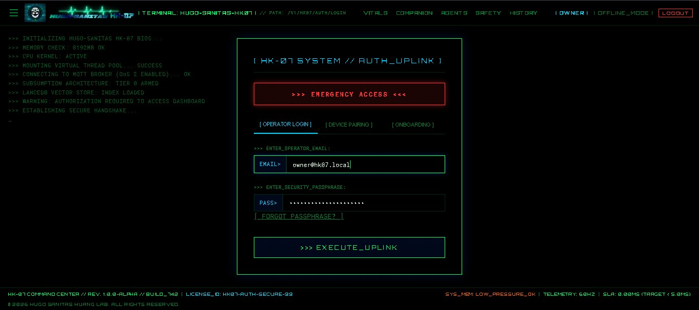
* **Mô tả:** Giao diện xác thực mang phong cách terminal tương lai. Thiết kế mô phỏng bảng điều khiển y tế/quân sự, yêu cầu thông tin đăng nhập được mã hóa an toàn.

#### B. Xác Thực Đa Yếu Tố (MFA) & Khôi Phục Bằng Backup Code
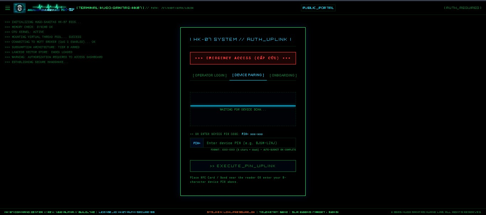
* **Mô tả:** Kênh xác thực dự phòng sử dụng các mã bảo mật (Backup Codes) được tạo ngẫu nhiên bằng mật mã học khi token của authenticator không khả dụng.

---

### 2. Giám Sát Chỉ Số Sinh Tồn Lâm Sàng

#### A. Bảng Giám Sát Dữ Liệu Sinh Tồn Thời Gian Thực (60FPS)
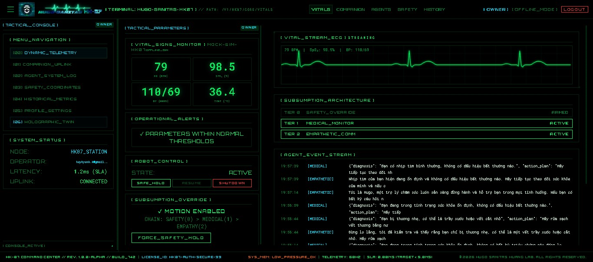
* **Mô tả:** Trung tâm điều khiển chính. Hiển thị trực quan các chỉ số sinh học (Nhịp tim, SpO2, Thân nhiệt, Huyết áp) cùng sóng điện tâm đồ (ECG) tần số 60Hz vẽ bằng HTML5 Canvas tăng tốc phần cứng.

#### B. Lịch Sử Biểu Đồ Sinh Tồn Lâm Sàng
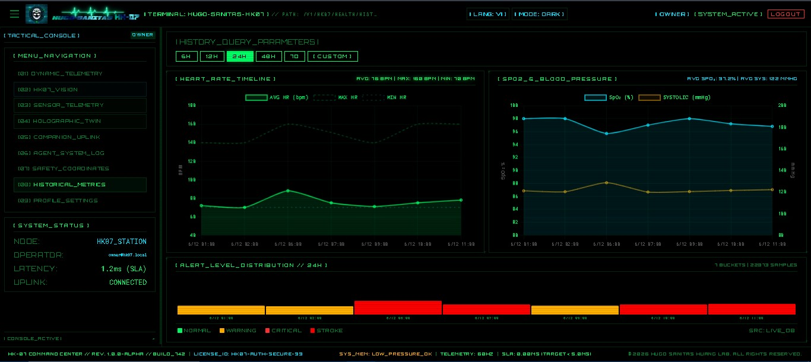
* **Mô tả:** Cho phép điều phối viên thiết lập khoảng thời gian linh hoạt (Từ ngày / Đến ngày) để tải, vẽ biểu đồ và phân tích diễn biến sức khỏe dài hạn của bệnh nhân.

---

### 3. Hệ Thống Trí Tuệ Nhân Tạo (AI Cognitive & Agents)

#### A. Kênh Trò Chuyện Thấu Cảm AI (Companion Dialogue)
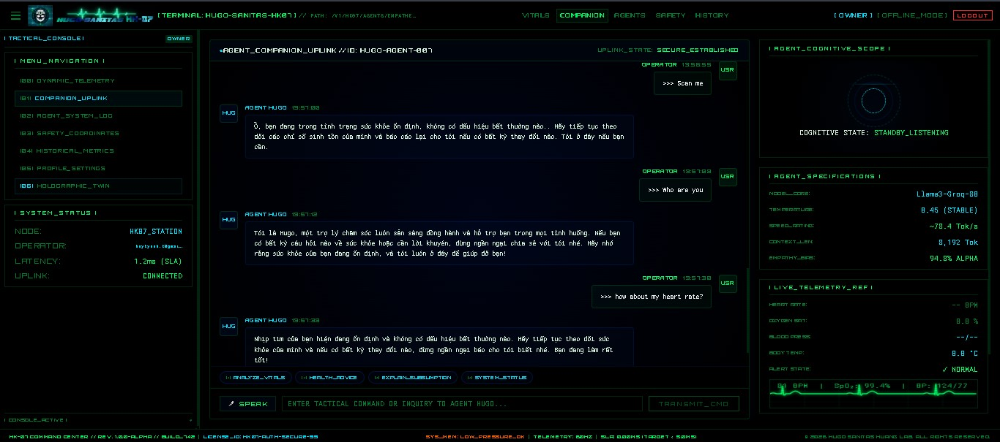
* **Mô tả:** Khung hội thoại tương tác được cung cấp bởi động cơ AI Đa tác nhân (Multi-Agent Engine) qua API Groq/Gemini. Đưa ra lời khuyên y tế, phân tích cảm xúc và trấn an tinh thần bệnh nhân.

#### B. Nhật Ký Hoạt Động Của Động Cơ Đa Tác Nhân (System Logs)
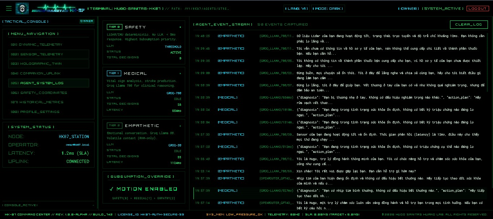
* **Mô tả:** Luồng dữ liệu log hiển thị chuỗi suy luận thời gian thực và hành động của các đặc vụ: `Vitals Monitor Agent` (Giám sát), `Emergency Agent` (Khẩn cấp), và `Empathetic Agent` (Thấu cảm).

---

### 4. Hệ Thống Điều Phối Robot & An Toàn Vật Lý

#### A. Mô Hình Robot 3D Holographic Twin & Radar Quét
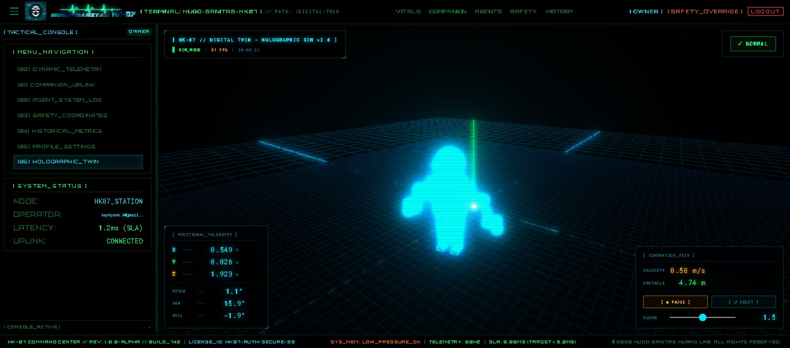
* **Mô tả:** Trực quan hóa bản đồ radar 3D ảo hiển thị trạng thái chuyển động vật lý, vùng cảm biến và hướng di chuyển của robot trong không gian thực thời gian thực.

#### B. Tọa Độ An Toàn & Cơ Chế Phanh Khẩn Cấp (Inhibition)
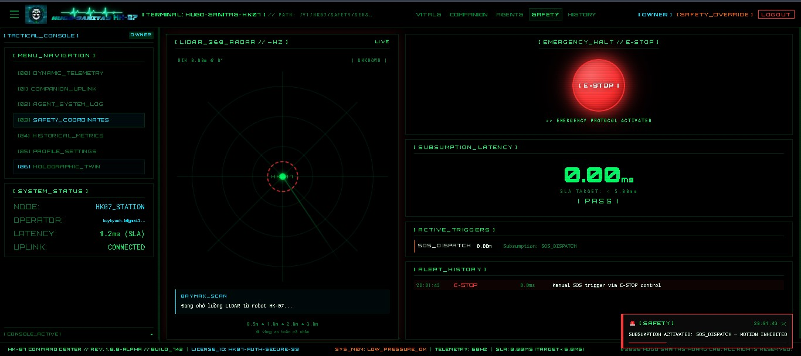
* **Mô tả:** Giám sát khoảng cách chướng ngại vật từ cảm biến LiDAR, tọa độ robot và tự động kích hoạt phản xạ ngắt động cơ ngay lập tức nếu phát hiện nguy cơ va chạm hoặc té ngã.

---

### 5. Giả Lập Camera & Xử Lý Thị Giác Máy Tính (Edge Vision)

#### A. Luồng Hình Ảnh Trực Tiếp Từ Camera Robot (Online)
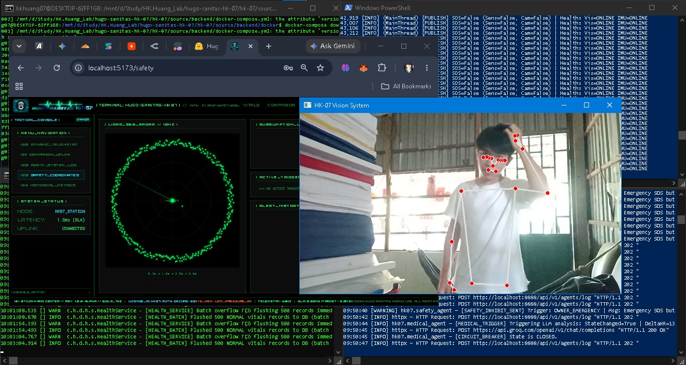
* **Mô tả:** Luồng camera truyền hình ảnh trực tiếp từ góc nhìn của robot khi di chuyển trong không gian giả lập Webots.

#### B. Luồng Hình Ảnh Bị Mất Kết Nối (Offline / Vision Stream Lost)
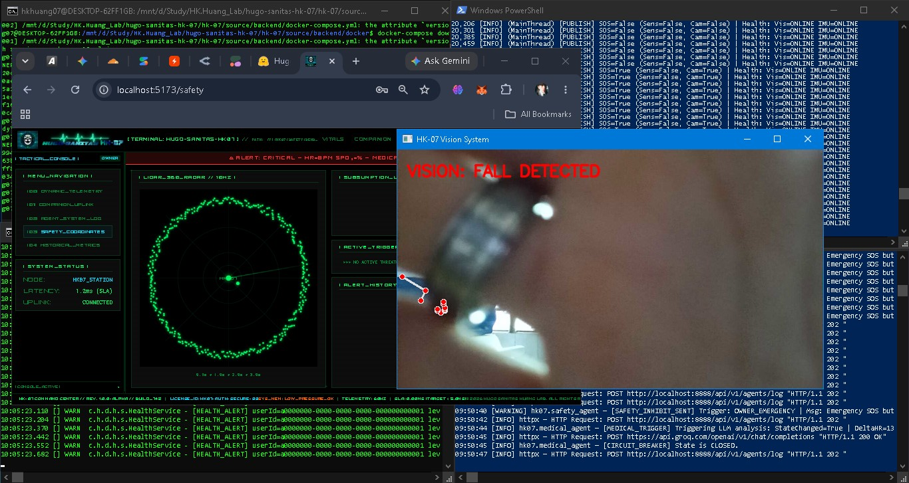
* **Mô tả:** Trạng thái an toàn tự động hiển thị khi mất luồng dữ liệu camera, cảnh báo cho nhân viên y tế từ xa về lỗi cảm biến.

#### C. Nhận Diện Hành Vi Bằng OpenCV & MediaPipe
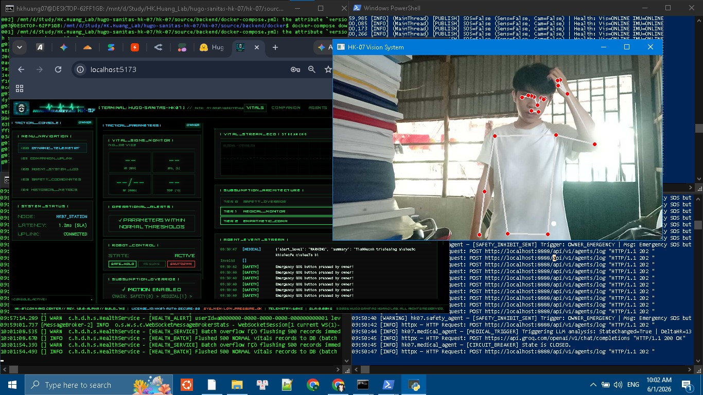
* **Mô tả:** Bộ xử lý thị giác máy tính biên phân tích tư thế nằm/đứng, khung xương, và khuôn mặt của bệnh nhân nhằm phát hiện sự cố té ngã tự động.

---

### 6. Hồ Sơ Bệnh Nhân & Cài Đặt Bảo Mật

#### A. Cấu Hình Hồ Sơ Sức Khỏe & Quản Lý Khóa Bảo Mật MFA
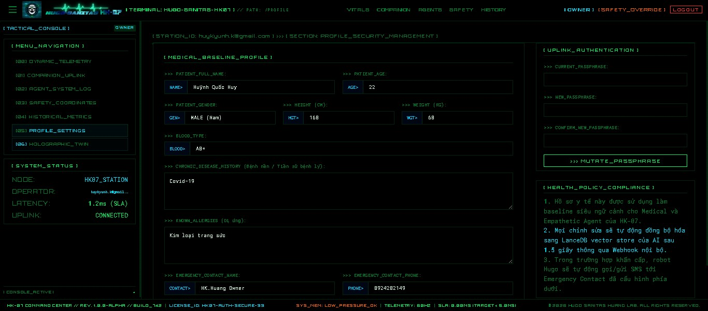
* **Mô tả:** Bảng quản trị chứa thông tin tóm tắt hồ sơ y tế bệnh nhân, thông tin tài khoản cá nhân, và cấu hình kích hoạt khóa xác thực đa yếu tố.

---

## ⚙️ Kiến Trúc Hệ Thống

```
┌─────────────────────────────────────────────────────────────┐
│          HK-07 HUGO SANITAS — SYSTEM ARCHITECTURE           │
├─────────────────┬───────────────────┬───────────────────────┤
│  [FRONTEND]     │   [BACKEND CORE]  │   [AGENT ENGINE]      │
│  Vue 3 + Vite   │  Spring Boot 3.2  │   Python FastAPI      │
│  Port: 5173     │   Java 21 VT      │   Port: 8889          │
│  Cyber-Dark UI  │   Port: 8888      │   3 Agent Loops       │
│                 │   JWT + RBAC      │   Groq/Gemini API     │
└────────┬────────┴────────┬──────────┴──────────┬────────────┘
         │  WebSocket/REST │   MQTT/WebSocket     │ MQTT
         ▼                 ▼                      ▼
┌────────────────┐  ┌─────────────┐  ┌───────────────────────┐
│    MySQL       │  │    Redis    │  │  Eclipse Mosquitto    │
│   (Persist)    │  │  (Buffer)   │  │  MQTT Broker :1883    │
└────────────────┘  └─────────────┘  └───────────────────────┘
                                              ▲
                              ┌───────────────┴───────────────┐
                              │     LỚP THIẾT BỊ CẢM BIẾN     │
                              │  Wokwi ESP32 (Vòng đeo tay)   │
                              │  ROS 2 LiDAR Mock Nodes       │
                              │  Giả lập Robot Webots         │
                              └───────────────────────────────┘
```

---

## 🛠️ Các Bài Toán Thực Tiễn Được Giải Quyết

1. **Độ Trễ Phản Xạ Khẩn Cấp Cực Thấp (<5ms):** Bỏ qua các khối ghi cơ sở dữ liệu đồng bộ thông thường để phát tín hiệu dừng khẩn cấp (như dừng bánh xe robot khi có chướng ngại vật hay gọi SOS) thông qua luồng MQTT được tối ưu hóa.
2. **Tối Ưu Hóa Ràng Buộc Tài Nguyên:** Vận hành trơn tru toàn bộ các dịch vụ phức tạp (Spring Boot, Python Agents, hệ cơ sở dữ liệu và trung gian thông điệp) trên một máy chủ thử nghiệm cấu hình thấp, giới hạn tổng lượng RAM tiêu thụ dưới **<615MB RAM**.
3. **Mô Hình Chẩn Đoán Lưỡng Tầng (Hybrid):** Kết hợp hai lớp xử lý: Lớp phản xạ cứng (Hard Reflex) dựa trên quy tắc logic ngưỡng cố định để đưa ra cảnh báo tức thời, và Lớp suy luận mềm (Soft Cognitive) tận dụng LLM và Multi-Agent để phân tích ngữ cảnh bệnh án và trò chuyện thấu cảm.
4. **Bảo Mật Dữ Liệu Sinh Tồn Thời Gian Thực:** Bảo vệ luồng WebSocket truyền thông số y sinh bằng bộ chặn kênh Inbound của STOMP (JWT Channel Interceptor), ngăn chặn truy cập trái phép vào luồng dữ liệu y tế nhạy cảm.

---

## 📦 Cấu Trúc Thư Mục

```
hk-07/
├── asset/                  ← Chứa ảnh chụp màn hình giao diện hệ thống
├── docs/                   ← Tài liệu đặc tả kỹ thuật và hướng dẫn
│   ├── 00-project-init/    ← Khởi động dự án, phân tích yêu cầu, techstack
│   ├── 01-system-design/   ← Kiến trúc hệ thống, cơ sở dữ liệu, đặc tả API
│   ├── 02-backend/         ← Hướng dẫn vận hành và nhật ký thay đổi Backend
│   ├── 03-frontend/        ← Nhật ký thiết kế UI/UX và đặc tả Frontend
│   ├── 04-testing/         ← Danh sách kiểm tra chất lượng và kịch bản test
│   ├── 05-deployment/      ← Cấu hình Docker và hướng dẫn triển khai
│   ├── 06-evolution/       ← Tài liệu cải tiến, spec nâng cấp và phân tích
│   └── MASTER_CHANGELOG.md ← Nhật ký thay đổi phiên bản toàn bộ hệ thống
└── source/                 ← Mã nguồn các thành phần dự án
    ├── backend/
    │   ├── hk07-core/      ← Mã nguồn Java Spring Boot Core
    │   ├── hk07-agent/     ← Mã nguồn Python AI Multi-Agent
    │   └── docker/         ← Các tệp cấu hình hạ tầng Docker
    ├── frontend/
    │   └── hk07-dashboard/ ← Mã nguồn Vue 3 Single Page Application
    └── docker-compose.yml  ← Tệp điều phối tích hợp toàn bộ stack
```

---

## 🚀 Hướng Dẫn Khởi Động Nhanh

Hệ thống hỗ trợ 2 chế độ vận hành: **Chạy Tích Hợp Bằng Docker** hoặc **Khởi Động Thủ Công Từng Thành Phần (Local Developer Mode)**.

### 1. Vận Hành Qua Docker Compose

```bash
# 1. Di chuyển vào thư mục chứa cấu hình backend
cd source/backend
cp .env.example .env
# Mở file .env và điền GROQ_API_KEY hoặc GEMINI_API_KEY phù hợp

# 2. Khởi động toàn bộ stack dịch vụ bằng container
docker compose up -d --build

# 3. Các cổng kết nối
# Dashboard Frontend:  http://localhost:4205 (Định tuyến qua Nginx)
# Backend Swagger Docs: http://localhost:8888/swagger-ui.html
# AI Agent API Docs:   http://localhost:8889/docs
```

Để chạy các tệp kịch bản giả lập thị giác máy tính và điều khiển robot hướng tới cụm Docker, thiết lập các biến môi trường và chạy:
```bash
export MQTT_BROKER_HOST=localhost
export MQTT_BROKER_PORT=1883
export MQTT_USERNAME=hk07sim
export MQTT_PASSWORD=mật_khẩu_mqtt_trong_file_env

# Chạy node xử lý thị giác máy tính OpenCV & MediaPipe
python source/sensors/vision_sensor/hk07_sensor_fusion.py

# Chạy node điều khiển động cơ robot giả lập Webots
python source/robotics/controllers/hk07_edge_controller.py
```

---

### 2. Khởi Động Thủ Công Trong Phát Triển Cục Bộ (Local Dev)

#### Bước 0: Khởi động các cơ sở dữ liệu và Broker nền
```bash
cd source/backend
docker compose up -d redis hk07-mysql mosquitto
```
*(Hoặc chạy các dịch vụ cài đặt cục bộ trên máy chủ gồm: Mosquitto broker cổng 1883, Redis cổng 6379, và MySQL cổng 3306).*

#### Bước 1: Khởi động Backend Core (Spring Boot)
```bash
cd source/backend/hk07-core
mvn clean install -DskipTests
mvn spring-boot:run
# Backend lắng nghe tại: http://localhost:8888
```

#### Bước 2: Khởi động Python AI Multi-Agent API
```bash
cd source/backend/hk07-agent
pip install -r requirements.txt
python -m uvicorn main:app --reload --port 8889
# Đặc vụ AI lắng nghe tại: http://localhost:8889
```

#### Bước 3: Khởi động Giao diện Frontend (Vue 3)
```bash
cd source/frontend/hk07-dashboard
npm install
npm run dev
# Giao diện hoạt động tại: http://localhost:5173
```

#### Bước 4: Khởi chạy các công cụ giả lập sự cố y tế
```bash
# Phát các tín hiệu giả lập đột quỵ, nhịp tim cao, vật cản trực tiếp tới broker
python source/robotics/simulation/trigger_heart_attack.py
python source/robotics/simulation/trigger_fall.py
python source/robotics/simulation/trigger_obstacle.py
```

---

## 💾 Phân Bổ Tài Nguyên Bộ Nhớ RAM Thực Tế

| Tên Dịch Vụ | Giới Hạn RAM | Trách Nhiệm Chi Tiết Trong Hệ Thống |
| :--- | :--- | :--- |
| **Mosquitto** | 32 MB | Broker MQTT trao đổi dữ liệu cảm biến thời gian thực |
| **Redis** | 64 MB | Bộ nhớ tạm lưu token & kiểm soát tần suất gửi tin |
| **MySQL** | 256 MB | Lưu trữ dữ liệu lịch sử sinh vật học & thông tin người dùng |
| **hk07-core** | 512 MB | Máy ảo JVM chạy dịch vụ Spring Boot Core |
| **hk07-agent** | 256 MB | Tiến trình Python chạy vòng lặp suy luận AI Multi-Agent |
| **TỔNG CỘNG** | **~615 MB** | **Tối ưu hóa tuyệt đối cho môi trường nhúng WSL2/Docker** |

---

## 👤 Tác Giả (Author)

* **Huỳnh Quốc Huy** (HK.Huang07)
* **Email:** [huykyunh.k@gmail.com](mailto:huykyunh.k@gmail.com)
* **GitHub:** [hkhuang07](https://github.com/hkhuang07)
* **LinkedIn:** [hkhuang07](https://www.linkedin.com/in/hkhuang07/)

---

## 📄 Bản Quyền (License)

Bản quyền sở hữu riêng (Proprietary / Closed Source) — Tất cả các quyền được bảo lưu.

Bản quyền © 2026 thuộc về HK.Huang07 (Dự án Hugo Sanitas).

Phần mềm này cùng tất cả tài liệu đi kèm là tài sản độc quyền của tác giả. Nghiêm cấm mọi hành vi sao chép, chỉnh sửa, phân phối, tái phân phối, xuất bản hoặc cấp phép lại dưới mọi hình thức, cho dù ở dạng mã nguồn hay mã máy, có hoặc không có sửa đổi, nếu không có sự đồng ý trước bằng văn bản từ chủ sở hữu bản quyền.
