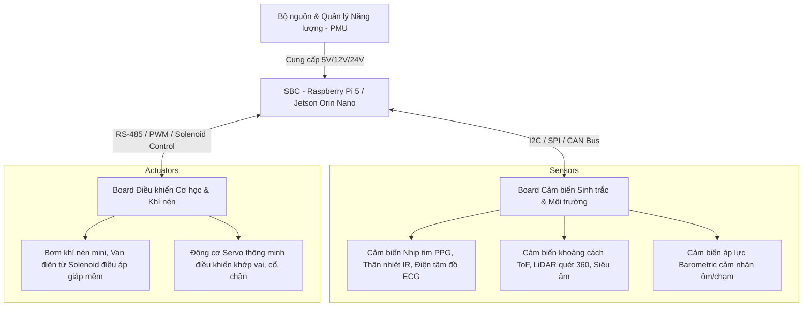

# BAN THIẾT KẾ KIẾN TRÚC HỆ THỐNG PHẦN CỨNG & MÔ PHỎNG ROBOT BAYMAX
**Mã dự án:** HK-07 // BAYMAX-INTELLIGENCE
**Độ tài liệu:** Kỹ thuật chuyên sâu (Hardware Specification & Simulation Blueprint)

---

## 1. Phân tích Hiện trạng (Gap Analysis)
Hệ thống hiện tại trong thư mục `source/sensors` đang sử dụng một cấu hình tối giản (Minimal Viable Product):
* **Cảm biến**: 01 gia tốc kế tuyến tính (từ điện thoại thông minh) qua giao thức HTTP POST.
* **Thị giác**: 01 luồng camera IP Webcam truyền luồng JPEG/MJPEG qua cổng 8080.
* **Hạn chế**: Không có phản hồi về trạng thái nguồn, hệ thống cơ khí, áp lực bơm khí, hay định vị không gian. Điều này xa rời thực tế vận hành của một Robot Y tế tự hành Baymax (vốn cần khả năng quét sinh trắc học toàn diện, chẩn đoán hành vi, di chuyển mềm và kiểm soát năng lượng).

---

## 2. Bản đồ Thiết kế Phần cứng Robot Baymax Vật lý (Physical Hardware Blueprint)

Để hiện thực hóa một Robot Baymax thực tế, hệ thống phần cứng được phân rã thành 3 phân hệ chính:



### A. Phân hệ Cảm biến & Sinh trắc học (Sensors & Biometrics Board)
1. **Quét Sinh trắc học từ xa (Contactless Vitals Grid)**:
   - **Cảm biến hồng ngoại nhiệt độ Ma trận (Thermal Grid Sensor - MLX90640)**: Quét bản đồ nhiệt độ cơ thể bệnh nhân từ xa để phát hiện sốt hoặc hạ thân nhiệt.
   - **Cảm biến PPG quang học (MAX30102 / MAX86141)**: Đo nhịp tim và nồng độ oxy trong máu (SpO2) khi chạm tay vào robot.
   - **Cảm biến Điện trở da (GSR - Galvanic Skin Response)**: Đánh giá mức độ căng thẳng, lo lắng của bệnh nhân.
2. **Nhận thức không gian (Spatial Awareness)**:
   - **LiDAR quét 360 độ (RPLIDAR A1/A2)**: Dựng bản đồ 2D thời gian thực để di chuyển tự hành và tránh chướng ngại vật (SLAM).
   - **Cảm biến khoảng cách Time-of-Flight (VL53L1X)**: Xác định khoảng cách chính xác đến đối tượng trong phạm vi 4m.
3. **Cảm biến xúc giác da mềm (Tactile Hug & Pressure Sensors)**:
   - **Cảm biến áp lực dạng màng mỏng (FSR - Force Sensitive Resistor)**: Trải đều trên lớp vỏ bơm hơi để đo lực ép khi robot ôm bệnh nhân, tránh gây chấn thương.
   - **Cảm biến áp suất khí trong khoang (Barometric Pressure Sensor - BMP280)**: Đo áp suất khí bên trong các túi chứa của Baymax để điều chỉnh độ căng/mềm của cơ thể.

### B. Phân hệ Năng lượng (Power Management Unit - PMU)
* **Pin nguồn**: Khối pin LiFePO4 (Lithium Iron Phosphate) 24V 20Ah tích hợp mạch sạc thông minh (BMS - Battery Management System).
* **Mạch giám sát tiêu thụ điện năng (Power Telemetry Board - INA226/INA219)**: Đo điện áp, dòng điện tức thời và công suất tiêu thụ của toàn hệ thống qua giao tiếp I2C.
* **Bộ chuyển đổi nguồn (Buck/Boost Regulators)**:
   - Cung cấp nguồn sạch 5V/5A cho máy tính nhúng (SBC) và cảm biến.
   - Cung cấp nguồn 12V/10A cho các solenoid valves và hệ thống bơm khí.
   - Cung cấp nguồn 24V cho các động cơ servo di chuyển.

### C. Phân hệ Điều khiển Cơ học & Khí nén (Actuation & Pneumatic Controller)
* **Mạch điều khiển van khí nén (Solenoid Valve Matrix Driver)**: Sử dụng các MOSFET công suất để điều khiển đóng/mở van điện từ (Solenoid Valves), điều hướng dòng khí nén làm phồng/xẹp các khoang cơ thể mềm của Baymax.
* **Hệ thống bơm khí mini (Micro Air Pumps)**: Bơm duy trì áp suất bên trong cơ thể robot để giữ phom dáng.
* **Động cơ Servo khớp (Smart Servos - AX-12A / Dynamixel XM430 via RS485)**: Điều khiển góc xoay các khớp chi mềm, cổ và hông của Baymax, cho phép cử động tự nhiên.

---

## 3. Kiến trúc Mô phỏng trên Web Application (Dashboard & Core Engine)

Để tối ưu hóa ứng dụng web bám sát nhất với mô hình phần cứng thật, hệ thống API và Dashboard được tái cấu trúc thành một **Digital Twin Dashboard** hiển thị chi tiết telemetry phần cứng:

```
[Mạng Cảm biến Phần cứng] --MQTT--> [MQTT Broker] <--> [FastAPI Core Engine] <--> [Vue/React Dashboard]
```

### A. Thiết kế MQTT Topic Tree (Data Bus)
Hệ thống sử dụng MQTT Broker (Mosquitto) làm trục truyền tin thời gian thực với các topic chuyên biệt:
- `hk07/telemetry/pmu`: Gửi dữ liệu điện áp (`voltage`), dòng điện (`current`), dung lượng pin (`soc`), nhiệt độ nguồn (`temp`).
- `hk07/telemetry/pneumatic`: Gửi áp suất khoang trái (`press_L`), khoang phải (`press_R`), trạng thái bơm (`pump_active`), trạng thái van xả (`relief_active`).
- `hk07/telemetry/actuators/joints`: Gửi góc xoay (`angle`), dòng tải (`torque`), nhiệt độ (`temp`) của 6 khớp chính (Cổ, Vai trái/phải, Hông, Chân trái/phải).
- `hk07/telemetry/sensors/tactile`: Gửi lực chạm ôm (`hug_force`), cảm biến độ uốn cong cơ thể (`flex_rate`).
- `hk07/telemetry/sensors/vitals`: Nhịp tim (`hr`), SpO2 (`spo2`), Thân nhiệt (`temp`), Mức căng thẳng (`stress`).

### B. Bản đồ Giao diện Web (Dashboard Components)
1. **Power Status HUD (Giao diện Năng lượng)**:
   - Thể hiện pin dưới dạng khối đồ họa chuyển động LED xanh neon/crimson.
   - Hiển thị đồ thị thời gian thực về dòng xả (discharge rate) để cảnh báo khi robot quá tải cơ học.
2. **Pneumatic Pressure HUD (Hệ thống Khí nén)**:
   - Bản đồ nhiệt (Heatmap) mô phỏng áp suất trong lớp vỏ của Baymax.
   - Nút E-STOP xả khí khẩn cấp (Emergency Air Release).
3. **Joint Kinematics HUD (Động học Khớp)**:
   - Mô hình 3D tối giản hiển thị góc quay hiện tại của các khớp servo. Cảnh báo đỏ nếu khớp bị kẹt cơ học hoặc quá nhiệt.

---

## 4. Prompt Chỉ thị AI triển khai mô phỏng Mock-Telemetry Engine

```markdown
> [ROLE]: Senior Full-Stack and IoT Simulation Engineer.
> [TASK]: Implement a real-time mock telemetry engine inside the HK-07 core agent python module to simulate a full physical Baymax robot hardware state.

1. Create a new simulation generator script named `source/sensors/simulation/baymax_telemetry_sim.py`.
2. The script must establish an MQTT connection using parameters loaded from the project's `.env` configuration file (refer to `source/backend/.env`).
3. Generate high-fidelity telemetry payloads every 1000ms:
   - **PMU (`hk07/telemetry/pmu`)**: Voltage (around 24.0V with normal noise), current (fluctuating based on pump/servo active states), battery State of Charge (SOC, decreasing 0.01% every few seconds), temperature.
   - **Pneumatics (`hk07/telemetry/pneumatic`)**: Simulated pressure values in PSI (ranging from 1.5 to 2.2 PSI). If pressure falls below 1.6 PSI, simulate the air pump turning ON (`pump_active = True`) and pressure rising. If a fall is detected, trigger emergency pressure relief (`relief_active = True`, pressure drops quickly to 0).
   - **Actuator Joints (`hk07/telemetry/actuators/joints`)**: 6-axis joint angles, torque levels, and motor temperature. Joint temperatures rise when joint velocity increases.
   - **Tactile Sens (`hk07/telemetry/sensors/tactile`)**: Continuous hug force sensing (0.0N at rest, spikes to 15N-30N when a hug event occurs).
   - **Biometrics (`hk07/telemetry/sensors/vitals`)**: Connect this to the existing vitals generator, but add stress level (GSR) and respiratory rate calculation based on simulated movement.
4. Integrate fall detection triggers: when a fall is reported on `hk07/sensors/imu/state`, trigger the pneumatic E-STOP deflation cycle automatically (set `relief_active = True` for 5 seconds to cushion the impact).
5. Ensure zero-dependency installation using native Python modules (`json`, `time`, `math`, `random`, `logging`) and use `paho-mqtt` (already in requirements) for connection.
```
