Đây là bản báo cáo của hệ thống ROS2 trong hệ thống, hãy tiến hành phân tích và phát triển tích hợp việc kế nối sensor mô phỏng tại trang /robotics/sensor/mobile_gateway và /robotics/sensor/vision_sensor vào hệ thống ROS2 chính. Loại bỏ các cầu nối trung gian không cần thiết và tối ưu hóa hiệu năng hoạt động . Đảm bảo tích hợp được dữ liệu từ sensor mô phỏng với hệ thống ROS2 chính. Tuyệt đối không giả lập dữ liệu sensor phải dùng cảm biến và camera thật để lấy dữ liệu. Hệ thống phải chạy real-time. Hệ thống chưa có động cơ nên cần xử lý mô phỏng tương đối các lệnh như bước , đí, chạy, dừng cầm nắm , phun, ôm ... Cần phải có giao diện để test hệ thống thông qua web và có thể điều khiển robot. 


# HK-07 Robotics Workspace & Telemetry Trace Audit Report
**Classification:** Definitive Technical Audit  
**Author:** 10x Principal Agentic Systems Engineer  
**System:** HugoSanitas HK-07 Robot Companion (MAS Phase 2)

---

## 1. Directory Tree & Architecture Mapping

Below is the verified file tree of the robotics sensor modules and simulation workspaces under `source/robotics/sensors/`:

```
source/robotics/sensors/
├── package.xml
├── setup.py
├── setup.cfg
├── requirements.txt
├── mobile_gateway/
│   ├── __init__.py
│   └── vivo_http_mqtt_bridge.py
├── vision_sensor/
│   ├── __init__.py
│   └── hk07_sensor_fusion.py
└── simulation/
    ├── __init__.py
    ├── balance_controller.py
    ├── baymax_telemetry_sim.py
    ├── hk07_physics_node.py
    ├── hk07_runtime_orchestrator.py
    ├── lidar_pointcloud_sim.py
    ├── navigation_agent.py
    ├── ros2_mqtt_bridge_node.py
    ├── rppg_thermal_node.py
    └── rtos_watchdog_simulator.py
```

### System Topology & Node Interaction Graph

The diagram below illustrates how data flow traverses the physical/simulated sensors, the bridging layers, and the multi-agent decision core:

```mermaid
graph TD
    %% Sensors & Bridges
    Vivo[SensorLogs Mobile App] -- HTTP POST /data --> BridgeScript[vivo_http_mqtt_bridge.py]
    BridgeScript -- MQTT Publish --> Mosquitto[Mosquitto Broker:1883]
    
    %% Simulation Nodes (ROS 2 Humble)
    subgraph ROS2_Humble_Workspace [ROS 2 Humble Simulation Loop]
        direction TB
        BridgeNode[ros2_mqtt_bridge_node.py]
        PhysicsNode[hk07_physics_node.py]
        LidarSim[lidar_pointcloud_sim.py]
        NavAgent[navigation_agent.py]
        BalanceCtrl[balance_controller.py]
        RppgThermal[rppg_thermal_node.py]
        Watchdog[rtos_watchdog_simulator.py]
        BaymaxSim[baymax_telemetry_sim.py]
        
        %% Internal ROS2 topics
        PhysicsNode -- /telemetry/joint_states --> BridgeNode
        PhysicsNode -- /telemetry/imu --> BridgeNode
        LidarSim -- /telemetry/lidar/points --> PhysicsNode & NavAgent & BridgeNode
        LidarSim -- /telemetry/avoidance --> PhysicsNode & BridgeNode
        BaymaxSim -- /telemetry/pmu --> BridgeNode
        BaymaxSim -- /telemetry/pneumatic --> BridgeNode
        BaymaxSim -- /telemetry/actuators/joints --> BridgeNode
        BaymaxSim -- /telemetry/sensors/tactile --> BridgeNode
        BaymaxSim -- /telemetry/sensors/vitals --> BridgeNode
        RppgThermal -- /sensors/camera/thermal_rppg --> BridgeNode
        
        BridgeNode -- /sensors/imu/state --> BalanceCtrl & BaymaxSim
        BridgeNode -- /vitals/wristband --> Watchdog & BaymaxSim
        Watchdog -- /vitals/wristband --> BaymaxSim
        
        BalanceCtrl -- /control/motion/cmd_vel --> BaymaxSim & BridgeNode
        NavAgent -- /control/motion/cmd_vel --> BaymaxSim & BridgeNode
    end

    %% Bridging ROS2 to MQTT
    BridgeNode <--> |Bidirectional Translation| Mosquitto
    
    %% Sensor Fusion App (FastAPI)
    FusionApp[hk07_sensor_fusion.py] <--> |Redundant Sub/Pub| Mosquitto
    IPCam[IP Webcam App] -- MJPEG Stream /video --> FusionApp
    
    %% Backend & Blackboard
    subgraph Backend_Services [FastAPI Agent Engine:8000]
        AgentMain[main.py]
        Orchestrator[agent_orchestrator_v2.py]
        SafetyWorker[Subsumption Safety Worker]
        Blackboard[(Redis Blackboard)]
    end
    
    Mosquitto <--> |MQTT Sub/Pub| Orchestrator
    Mosquitto --> |MQTT Sub| SafetyWorker
    SafetyWorker --> |Trips Inhibit| Blackboard
    
    %% Core & Frontend
    SpringCore[hk07-core:8888] <--> |REST /api/v1/agents| AgentMain
    SpringCore <--> |STOMP over WebSocket| WebFrontend[hk07-dashboard:3000]
    
    %% GAP Trigger
    Orchestrator -- Tool Call: fetch_sensor_telemetry --> ErrorGap{localhost:3000/sensor-telemetry}
    ErrorGap -.-> |Returns HTML index - Parse Error!| Orchestrator
```



---

## 2. Structural Audit Questions & Detailed Answers

### 1. Bridge Architecture Analysis (`vivo_http_mqtt_bridge.py`)

* **Execution Nature:** It is a **pure Python script running a Flask web server**, not a native ROS 2 node. It does not import `rclpy` or use ROS 2 message definitions.
* **Stream Subscription & Routing:** It does not directly subscribe to MQTT streams. Instead, it **hosts an HTTP POST server** on port `5005` (with dynamic increment fallback if occupied) to receive telemetry packets pushed by a mobile device running the *Sensor Logs* app.
* **Input-Output Data Mapping:**

| Input Channel (HTTP JSON Payload Key) | Output MQTT Topic | Translated JSON Schema / Fields |
| :--- | :--- | :--- |
| `heart_rate`, `spo2`, `temperature` | `hk07/sensors/wristband/wristband-sim-001/vitals` | `{"heartRate": int, "systolic": float, "diastolic": float, "bodyTemperature": float, "spo2": float, "emergency_button_pressed": bool, "timestamp_ms": int}` |
| `accelerometer` (raw) | `hk07/sensors/imu/state` | `{"accel_x": float, "accel_y": float, "accel_z": float, "timestamp_ms": int}` |
| `accelerometer` + `gyroscope` + `magnetometer` + `gravity` (fused) | `hk07/sensors/imu/target` | `{"header": {"stamp": {"sec": int, "nanosec": int}, "frame_id": "imu_link"}, "orientation": {"w": float, "x": float, "y": float, "z": float}, "angular_velocity": {"x": float, "y": float, "z": float}, "linear_acceleration": {"x": float, "y": float, "z": float}, "magnetometer": {"x": float, "y": float, "z": float}, "compass_heading": float, "position": {"x": float, "y": float, "z": float}}` *(Quaternion computed via complementry filter)* |
| `light`, `barometer` | `hk07/sensors/environment/state` | `{"ambient_light": float, "barometric_pressure": float, "pressure_delta_hpa": float, "timestamp_ms": int}` |
| `location` (GPS) | `hk07/sensors/location/gps` | `{"latitude": float, "longitude": float, "altitude": float, "timestamp_ms": int}` |
| `pedometer`, `activity`, `wrist_motion` | `hk07/sensors/activity/metrics` | `{"pedometer_steps": int, "activity_type": string, "wrist_motion": float[], "timestamp_ms": int}` |

---

### 2. Sensor Fusion Evaluation (`hk07_sensor_fusion.py`)

* **Execution Nature:** It is a **FastAPI backend application** (running on port `5007` or dynamically allocated), not a native ROS 2 node. It does not import `rclpy` or use ROS 2 executors, `TimeSynchronizer`, or `MessageFilter`.
* **Entry Points:**
  1. **FastAPI HTTP Endpoint (`/data`)**: Listens for HTTP POST telemetry packets from the mobile device.
  2. **MQTT Subscriber Thread (`mqtt_subscriber_loop`)**: Triggered in redundant mode if port `5007` is blocked. Subscribes to `hk07/sensors/imu/state` to retrieve telemetry.
  3. **Vision Worker Thread (`blocking_vision_worker`)**: Spawns inside a `ThreadPoolExecutor` to handle CPU-heavy OpenCV capture (`cv2.VideoCapture`) from the camera URL `http://<IP_DIEN_THOAI>:8080/video` and executes MediaPipe Pose tracking.
  4. **Vision LLM Snapshot Analyzer (`snapshot_analyzer_loop`)**: Pulls video frame snapshots every 5 seconds and sends them to Gemini Flash via `LLMClient` to detect injuries, distress, and hazards.
* **MQTT Topics Subscribed to:**
  * `hk07/sensors/imu/state` *(Only when active in redundant MQTT subscriber mode)*
* **Fused Data Outputs:**

| Output MQTT Topic | Data Payload Fields | Fusion / Analysis Origin |
| :--- | :--- | :--- |
| `hk07/sensors/camera/thermal_rppg` | `{"rppg_heart_rate": float, "thermal_temperature": float, "fever_alert": bool, "tracker": {"x": float, "y": float, "width": float, "height": float}, "timestamp_ms": int}` | Forehead ROI isolated from MediaPipe landmarks; rPPG heart rate computed via FFT on green color variations. Thermal temp is simulated. Bounding box coordinates normalized. |
| `hk07/perception/clinical` | `{"visible_injuries": {...}, "facial_distress": {...}, "environmental_hazards": {...}}` | Vision LLM (Gemini Flash) frame evaluation. |
| `hk07/vitals/wristband`<br>`hk07/sensors/wristband/wristband-sim-001/vitals` | `{"heartRate": int, "systolic": float, "diastolic": float, "bodyTemperature": float, "spo2": float, "emergency_button_pressed": bool, "is_falling": bool, "vision_fall_detected": bool, ...}` | Logical OR fusion of IMU complementary-filter fall flags and computer vision pose-based fall flags (nose Y below hip Y). Distressed states trigger simulated critical vital signs. |

---

### 3. Trace Simulation Veracity (`simulation/` Directory)

* **Audit Determination:** This is a **fully functional mathematical physical simulator, not static mock loops**. It runs native ROS 2 Humble nodes (using `rclpy`) that implement continuous ODEs, kinematics solvers, and safety algorithms.
* **Simulation & Physical Logic Breakdown:**

#### A. Inflatable Pneumatic Suit & PMU Models (`baymax_telemetry_sim.py`)
* **State Machine:** Simulates states `IDLE`, `WALKING`, `HUGGING`, and `DISTRESSED` (estop safety deflation).
* **Pneumatic Leakage & Re-inflation:**
  * In `IDLE`, pressure decays due to leakage: $P_{t+1} = \max(1.65, P_t - \mathcal{U}(0.005, 0.015))$ PSI.
  * If pressure falls below $1.72$ PSI, the pump activates ($P_{t+1} = \min(1.88, P_t + \mathcal{U}(0.03, 0.07))$) until it exceeds $1.85$ PSI.
  * In `HUGGING`, pressure is boosted up to $2.35$ PSI to stiffen the suit armor.
  * In `DISTRESSED` (E-STOP triggered), pressure deflates rapidly: $P_{t+1} = \max(0.0, P_t - 0.4)$ PSI per second.
* **Power Management Unit (PMU) Physics:**
  * Battery state of charge (SoC) decays dynamically under load:
    $$SoC_{t+1} = SoC_t - (0.0025 + I_{total} \cdot 0.0012)\%$$
  * Current $I_{total}$ depends on the active mechanical state: IDLE ($0.55\text{ A}$), walking ($1.4\text{ A} + \text{servo load}$), hugging ($0.5 + 2.5\text{ (pump)} + 1.2\text{ (servos)}\text{ A}$).
  * Voltage drops dynamically based on load current: $V = 24.2 - (I_{total} \cdot 0.14) + noise$.
  * Battery temperature climbs as current increases: $T = 32.0 + (I_{total} \cdot 0.8) + noise$.

#### B. Artificial Potential Field (APF) Obstacle Repulsion (`lidar_pointcloud_sim.py` & `navigation_agent.py`)
* **LiDAR Scan Generation:** Generates a moving virtual obstacle oscillating along the X-axis: $x_{obs} = 1.3 + 1.0 \cos(t \cdot 0.1)\text{ m}$. It publishes a cluster of 25 points centered at this coordinate as a native `sensor_msgs/msg/PointCloud2` topic (`/telemetry/lidar/points`).
* **Repulsive Potential Field:**
  If the Euclidean distance $d$ between the robot and the obstacle is less than the safety radius $r_0 = 1.0\text{ m}$, it calculates a repulsive force vector:
  $$\vec{F}_{rep} = \eta \left(\frac{1}{d} - \frac{1}{r_0}\right) \frac{1}{d^2} \vec{u}_{rep}$$
  Where $\eta = 8.0$ (repulsive gain), and $\vec{u}_{rep}$ is the unit vector pointing away from the obstacle. The velocity output is capped at $2.0\text{ m/s}$ and published as `/telemetry/avoidance`.

#### C. Mass-Spring-Damper Torso Physics & Analytical Upper-Arm IK (`hk07_physics_node.py`)
* **Torso Mechanical Integration:**
  Calculates the force pulling the robot pelvis toward the target waypoint using a spring-damper controller coupled with LiDAR repulsion forces:
  $$\vec{F}_{total} = k (\vec{x}_{target} - \vec{x}_{robot}) - c \vec{v}_{robot} + \sum_{p \in LiDAR} \vec{F}_{rep}(p)$$
  Where $k = 180.0\text{ N/m}$ (spring coefficient), $c = 18.0\text{ Ns/m}$ (damping), and $m = 1.0\text{ kg}$ (mass). The state is integrated using Euler's method at $50\text{ Hz}$ ($dt=0.02$).
* **Two-Link Analytical Inverse Kinematics (IK):**
  Solves the arm joints ($\theta_s$: shoulder, $\theta_e$: elbow) using the Law of Cosines to follow a target coordinate offset by the avoidance vector:
  $$\theta_e = -\arccos\left(\frac{d^2 - L_1^2 - L_2^2}{2 L_1 L_2}\right)$$
  $$\theta_s = \arctan2(t_y, t_x) + \arccos\left(\frac{L_1^2 + d^2 - L_2^2}{2 L_1 d}\right)$$
  Where upper arm length $L_1 = 0.35\text{ m}$, forearm length $L_2 = 0.30\text{ m}$, and $d$ is the distance from the shoulder pivot to the target point. Joint coordinates are published to `/telemetry/joint_states`.

#### D. Standing Balance PID Controller (`balance_controller.py`)
* **Stance Stabilization:** Subscribes to the IMU state to measure pitch ($\theta_p$) and roll ($\theta_r$) tilt angles relative to gravity:
  $$\theta_p = \arctan2(a_x, \sqrt{a_y^2 + a_z^2}), \quad \theta_r = \arctan2(a_y, \sqrt{a_x^2 + a_z^2})$$
* **Corrective Velocity PID:** Computes corrective velocities to push the robot back to a vertical orientation ($\theta_{target} = 0$):
  $$v_{corrective} = K_p e(t) + K_i \int_{0}^{t} e(\tau)d\tau + K_d \frac{de(t)}{dt}$$
  With constants $K_p = 1.8$, $K_i = 0.05$, $K_d = 0.35$ and anti-windup clamping, outputting up to $\pm 1.5\text{ m/s}$ to `/control/motion/cmd_vel`.

#### E. rPPG Heart Rate Extraction (`rppg_thermal_node.py`)
* **Synthetic Signal Generation:** When no camera is present, generates a synthetic green channel light signal representing blood volume pulses:
  $$G(t) = 128.0 + 1.2 \sin(2\pi f t) + \text{noise}$$
  Where $f = \frac{HR}{60}\text{ Hz}$.
* **FFT Pulse Rate Detection:** Runs a Discrete Fourier Transform (DFT) on a 100-sample sliding buffer at $10\text{ Hz}$. It isolates the peak frequency in the human heart rate band ($[0.75, 2.5]\text{ Hz}$ or $[45, 150]\text{ BPM}$) to estimate heart rate:
  $$HR = \arg\max_{f \in [0.75, 2.5]} |X(f)| \cdot 60$$

---

### 4. Mapping the Backend-ROS 2 Communication Channels

* **Direct Connections:** There are **no direct communication links** (such as gRPC, WebSockets, or ROS 2 publishers/subscribers) connecting the `/robotics/` workspace scripts directly to `hk07-agent` (FastAPI).
* **Indirect Broker Setup:**
  All communication is routed asynchronously through the **Mosquitto MQTT Broker (`hk07-mosquitto:1883`)**:
  1. The ROS 2 node `ros2_mqtt_bridge_node.py` subscribes to ROS 2 topics and republishes them as MQTT JSON topics.
  2. The FastAPI agents (`medical_agent.py` and `safety_agent.py`) run background threads subscribing to Mosquitto MQTT topics. They write parsed data to the **Redis Blackboard** or memory buffers.
  3. `hk07-core` (Spring Boot Core on port `8888`) handles client STOMP WebSocket streams and connects to `hk07-agent` via REST APIs (port `8000`).
* **The Telemetry & Vision Gateway Port 3000 Gap:**
  * **The Problem:** The LiteLLM tool-calling layer in `hk07-agent` has registered tools `fetch_sensor_telemetry()` and `capture_vision_payload()` that request `http://localhost:3000/sensor-telemetry` and `http://localhost:3000/vision` using an HTTP client (`httpx`).
  * **The Gap:** Port `3000` is actually bound to the **Vite development server** for the Vue frontend dashboard. Because Vite only serves static HTML/JS assets (client-side routing fallbacks), any HTTP request to those URLs returns the Vue `index.html` file instead of JSON telemetry.
  * **The Consequence:** The HTTP client fails to parse the HTML response as JSON, catches the exception, and returns `[SYSTEM_PERCEPTION_ERROR]: Sensor connection offline` to the LLM. This **blinds the LLM** and forces it to report sensor failures during chat interactions, even though the FastAPI backend already has access to the live telemetry stream via its direct MQTT background subscribers and Redis Blackboard.

---

## 3. Summary of Core Findings & Gap Resolution Strategy

1. **Bridge:** `vivo_http_mqtt_bridge.py` is a Flask HTTP-to-MQTT translator script, not a ROS 2 node.
2. **Fusion:** `hk07_sensor_fusion.py` is a FastAPI application running OpenCV and MediaPipe in a separate thread.
3. **Simulation:** The simulation folder is a fully functional mathematical simulator running ROS 2 nodes implementing mass-spring-damper, APF repulsion, Law of Cosines Inverse Kinematics, PID balance loops, and DFT heart rate extraction.
4. **Backend-ROS2 Gap:** The `telemetry_client` is hitting the Vite frontend dev server (port 3000) instead of querying a backend buffer or direct MQTT streams, blinding the tool-calling LLM.

### Proposed Gap Fix (For Future Execution)
To resolve this gap, we should modify `services/telemetry_client.py` inside `hk07-agent` to read directly from the in-memory/Redis `SensorFusionBuffer` (which is already populated by the active background MQTT subscribers) or query the local Redis Blackboard, bypassing the faulty port 3000 HTTP requests entirely.
