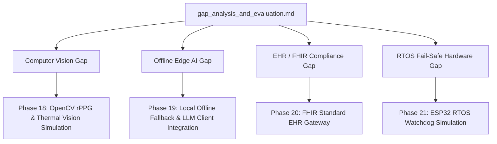

# Multi-Phase Architecture Roadmap & Implementation Plan (Gaps & System Evaluation)

This plan outlines high-performance, modular, and extensible designs for the subsequent development phases of the **Hugo Sanitas HK-07** platform. It resolves the gaps documented in [00_gap_analysis_and_evaluation.md](00_gap_analysis_and_evaluation.md) against the current capabilities of the system.

---

## 📊 Gap Analysis & Proposed Solutions

| Gaps Identified in Audit | Root Cause | Proposed Long-term Architecture |
| :--- | :--- | :--- |
| **ROS 2 Bridging Latency & Gaps** | Telemetry topics are simulated but not integrated end-to-end into the Spring Boot backend or Vue frontend; `rppg_thermal_node` lacks a bridge. | Implement explicit ROS 2 → MQTT bridging for `/sensors/camera/thermal_rppg` and add core STOMP WebSocket support. |
| **Ignored Live Biometrics** | Vue frontend updates `vitalsStore` but reads text displays from `telemetryStore`, which is only updated by the mock sensor service. | Refactor `websocket.ts` to sync live WebSocket data to both `vitalsStore` and `telemetryStore`. |
| **100% Dependency on Cloud API** | Router and Agents freeze if internet drops; no offline/fallback capability. | Build `LocalOfflineFallback` inside `LLMClient` using zero-dependency keyword matrix matching + template generation to prevent thread blocks. |
| **Missing Medical Data Standards** | Vitals and diagnostic results are saved as unstructured JSON, not complying with clinical EHR standards. | Introduce a `FhirGatewayService` formatting data into standard HL7 FHIR JSON `Observation` and `Condition` resources. |
| **No RTOS Watchdog hardware fail-safe**| Core safety is running on primary OS middleware; if OS freezes, soft robotics will fail to deflate safely. | Develop a ROS 2 hardware watchdog node simulating an ESP32 co-processor that deflates robotics if heartbeat drops for 3.0s. |

---

## 🛠️ Phase Designs & Component Blueprints

### 1. PHASE 18: OpenCV rPPG & Thermal Vision Simulation End-to-End
- **Objective**: Link the simulated heart rate (rPPG) and thermal forehead crop sensor measurements to the UI.
- **Architectural Design**:
  - **MQTT Topic**: Bridge `ros2_mqtt_bridge_node.py` to subscribe to ROS 2 topic `/sensors/camera/thermal_rppg` (type `sensor_msgs/JointState`) and publish to MQTT `hk07/sensors/camera/thermal_rppg`.
  - **Backend Core Routing**: Register the MQTT topic in Spring Boot `MqttConfig.java` and parse it in `MqttInboundProcessor.java`, broadcasting it to WebSocket destination `/topic/hk07/sensors/camera/thermal_rppg`.
  - **Frontend UI & Store**: Subscribe in `websocket.ts`, write data to `kinematicsStore` (or create a dedicated telemetry state), and update `CompanionView.vue` to show real-time face scan details (rPPG Heart Rate, Forehead Temp, Fever Alert status).
  - **Bug Fix**: In `websocket.ts`, update `telemetryStore` using `vitalsStore` values upon receiving `/topic/vitals` messages to sync text fields in the main dashboard.

#### [MODIFY] [ros2_mqtt_bridge_node.py](file:///d:/Study/HK.Huang_Lab/hugo-sanitas-hk-07/hk-07/source/sensors/simulation/ros2_mqtt_bridge_node.py)
Update subscriptions to listen to `/sensors/camera/thermal_rppg` and publish to MQTT.

#### [MODIFY] [MqttConfig.java](file:///d:/Study/HK.Huang_Lab/hugo-sanitas-hk-07/hk-07/source/backend/hk07-core/src/main/java/com/hk07/infrastructure/mqtt/MqttConfig.java)
Add `hk07/sensors/camera/thermal_rppg` to subscribed inbound topics.

#### [MODIFY] [MqttInboundProcessor.java](file:///d:/Study/HK.Huang_Lab/hugo-sanitas-hk-07/hk-07/source/backend/hk07-core/src/main/java/com/hk07/infrastructure/mqtt/MqttInboundProcessor.java)
Handle parsing of JointState formatted thermal metrics and forward to WebSocket destination.

#### [MODIFY] [websocket.ts](file:///d:/Study/HK.Huang_Lab/hugo-sanitas-hk-07/hk-07/source/frontend/hk07-dashboard/src/services/websocket.ts)
Sync incoming vital signs into `telemetryStore` to fix the dashboard display bug. Add subscription to thermal/rPPG WebSocket topic.

---

### 2. PHASE 19: Local Edge LLM Fallback (Zero-Dependency & ONNX)
- **Objective**: Ensure 100% offline autonomy. When Groq/OpenRouter fails (timeouts, 429 errors), fallback to a zero-overhead local keyword classifier matrix, preventing middleware thread hangs.
- **Architectural Design**:
  - Build `LocalOfflineFallback` within `LLMClient`. It parses user messages against a deterministic regex matrix (e.g., matching clinical symptoms, emotional statements, hardware checks) and builds standard responses dynamically.
  - Implement fallback handling in `llm_client.py` generating response strings instantly if cloud endpoints time out.

#### [MODIFY] [llm_client.py](file:///d:/Study/HK.Huang_Lab/hugo-sanitas-hk-07/hk-07/source/backend/hk07-agent/services/llm_client.py)
Integrate a local matcher class returning static/dynamic clinical diagnostic structures when internet is down.

---

### 3. PHASE 20: FHIR Standard EHR Clinical Gateway
- **Objective**: Standardize diagnostic reports to comply with healthcare software (HL7 FHIR JSON).
- **Architectural Design**:
  - Introduce `FhirGatewayService` inside `source/backend/hk07-agent/services/`.
  - Translate Blackboard's `ClinicalEntry` into FHIR resources:
    - **FHIR Observation**: Pack numerical values (Heart Rate, SpO2, Body Temp) with coding `http://loinc.org`.
    - **FHIR Condition**: Pack diagnoses (e.g. Tachycardia, Fever) with SNOMED-CT codes.
  - Expose API endpoints in FastAPI to fetch history as FHIR resources.

#### [NEW] [fhir_gateway_service.py](file:///d:/Study/HK.Huang_Lab/hugo-sanitas-hk-07/hk-07/source/backend/hk07-agent/services/fhir_gateway_service.py)
Contains formatting methods to serialize patient diagnostics to HL7 FHIR standards.

---

### 4. PHASE 21: ESP32 RTOS Fail-Safe Emulation
- **Objective**: Implement a hardware-like watchdog representing an ESP32 co-processor that automatically deflates the soft robotics suit if the Linux/Windows OS backend crashes.
- **Architectural Design**:
  - Create a new ROS 2 Node `rtos_watchdog_simulator.py`.
  - Subscribe to `/system/heartbeat` published by the primary middleware at 1Hz.
  - Maintain a watchdog timer of 3.0 seconds. If no heartbeat is received, write a critical emergency state to `blackboard:safety:watchdog` and issue a ROS 2 `/telemetry/pneumatic` command setting `relief_active = True` (deflating actuators).

#### [NEW] [rtos_watchdog_simulator.py](file:///d:/Study/HK.Huang_Lab/hugo-sanitas-hk-07/hk-07/source/sensors/simulation/rtos_watchdog_simulator.py)
Watchdog simulation verifying system health, triggering pressure release on middleware freeze.

---

## 📈 Verification Plan

### Automated Checks
- Compile verification: `python3 -m py_compile source/sensors/simulation/*.py`
- Test ROS 2 nodes in background, execute `ros2 topic echo /sensors/camera/thermal_rppg` to verify output structure.

### Manual Verification
- Launch simulation services: `python source/sensors/simulation/rppg_thermal_node.py` and bridge.
- View dashboard companion page. Verify that temperature and heart rate update live without using static mocks.
- Kill the main middleware process and verify that `rtos_watchdog_simulator` triggers `relief_active = true` (deflation command) after 3 seconds.
