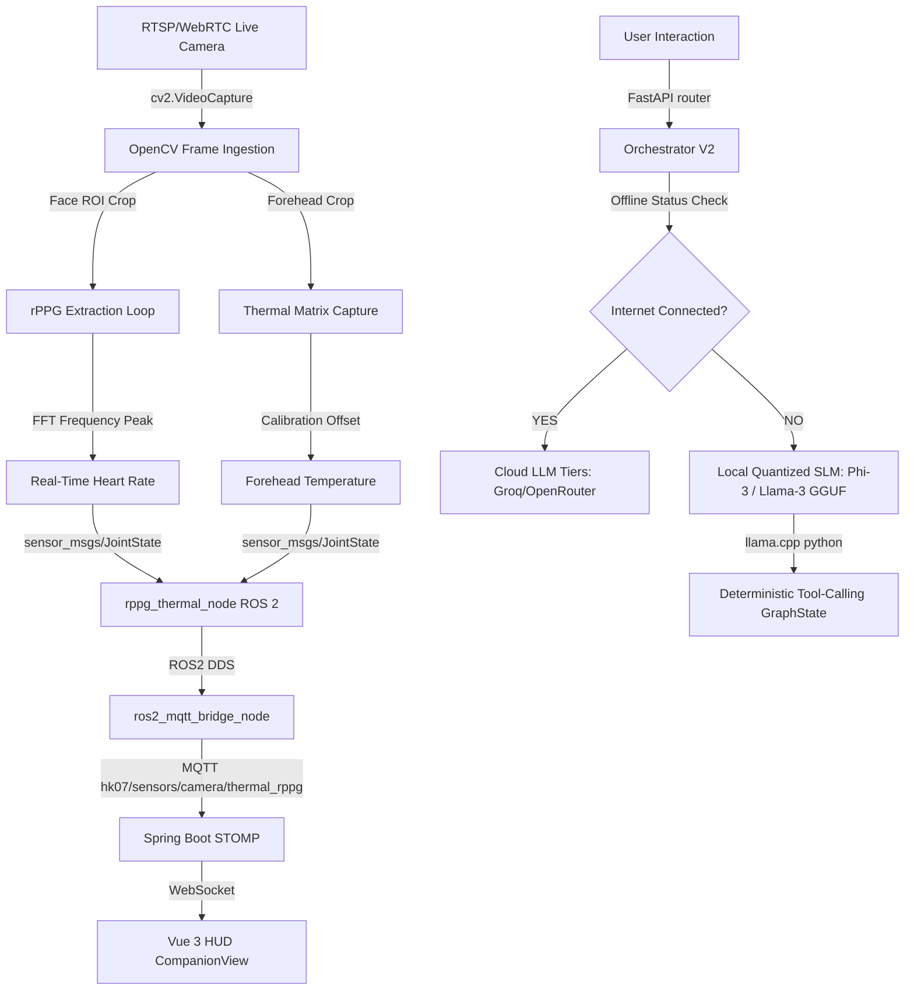

# ARCHITECTURE DESIGN: PHASE 22 (REAL-VISION STREAM & QUANTIZED EDGE SLM)
**System:** Hugo Sanitas HK-07  
**Pillar:** Tier-0.5 Perception & Tier-2 Cognitive Offline Fallback  
**Aesthetic Matrix:** Big Hero 6 / Hulk (2008) Medical Lab HUD Vibe  

---

## 📊 1. SYSTEM ARCHITECTURE METRICS



---

## 📹 2. REAL-VISION STREAM INTEGRATION (OPENCV rPPG)

To transition from synthetic physiological logs to true real-time perceptual telemetry, we introduce the **Real-Vision Ingestion Pipeline** inside [rppg_thermal_node.py](file:///d:/Study/HK.Huang_Lab/hugo-sanitas-hk-07/hk-07/source/robotics/sensors/simulation/rppg_thermal_node.py):

### A. Video Source Connection & Reconnect Loop
- Maintain a thread-safe video capture resource utilizing `cv2.VideoCapture(RTSP_URL_OR_WEBRTC_FEED)`.
- Configure an asynchronous reconnect logic with Exponential Backoff (1s, 2s, 4s, 8s, up to 30s) if connection to the stream drops, preventing thread blocking.

### B. Face Mesh ROI Extraction
- Utilize **MediaPipe Face Detection** (or Haar Cascades for low-resource microcontrollers) to isolate the face bounding box.
- Extract the cheek/forehead region of interest (ROI) to measure raw micro-fluctuations in blood volume pulse (BVP).

### C. FFT Heart Rate Extraction (rPPG)
- Standardize the Green Channel average intensity over a sliding buffer of 100 samples (10 seconds window at 10Hz).
- Apply a **Butterworth Bandpass Filter** (0.75 Hz to 2.5 Hz, corresponding to 45 - 150 BPM) to eliminate environmental lighting drift and motion noise.
- Compute the **Fast Fourier Transform (FFT)** of the detrended signal and extract the peak frequency to determine heart rate.

---

## 🧠 3. EDGE AI QUANTIZATION (LOCAL SLM OFFLINE INFERENCE)

To remove 100% dependency on external API servers and protect user health telemetry privacy, the local fallback matrix implemented in Phase 19 is upgraded to run quantized small language models (SLM) locally.

### A. Execution Runtime
- Integrate **llama-cpp-python** or **ONNX Runtime** into the Python environment.
- Run models quantized to 4-bit/8-bit precision (e.g., GGUF or ONNX quantized tensors) to fit within the limited memory space of standard edge processors (e.g. Jetson Orin Nano, local server CPU).

### B. Targeted Models
- **Microsoft Phi-3-mini-4k-instruct (GGUF, 3.8B parameters, 4-bit quantized)**: High reasoning capability, extremely small memory footprint (~2.2GB).
- **Llama-3-8B-Instruct (GGUF, 4-bit quantized)**: High accuracy for general clinical intents and empathetic conversational support (~4.7GB).

### C. Prompt Engineering & Structured Outputs
- Standardize system prompts to enforce strict JSON schemas matching `GraphState` and tool configurations:
  ```json
  {
    "tools_to_invoke": ["analyze_clinical_symptoms", "speak_empathetic_response"],
    "tool_calls": [
      {
        "tool_name": "analyze_clinical_symptoms",
        "parameters": {"symptom_description": "...", "urgency_level": "..."}
      }
    ]
  }
  ```

---

## 🛠️ 4. VERIFICATION & DEPLOYMENT PLAN

### A. Vision Ingestion Test
1. Set up an RTSP video source or stream mock feed via OBS virtual camera.
2. Compile and run:
   ```bash
   python source/robotics/sensors/simulation/rppg_thermal_node.py --video-src rtsp://localhost:8554/live
   ```
3. Verify ROS 2 topic output:
   ```bash
   ros2 topic echo /sensors/camera/thermal_rppg
   ```

### B. Local SLM Performance Benchmarking
1. Run local inference test scripts to measure tokens/second and memory consumption of Phi-3 GGUF.
2. Ensure latency for local response generation is under **1.5 seconds**.
