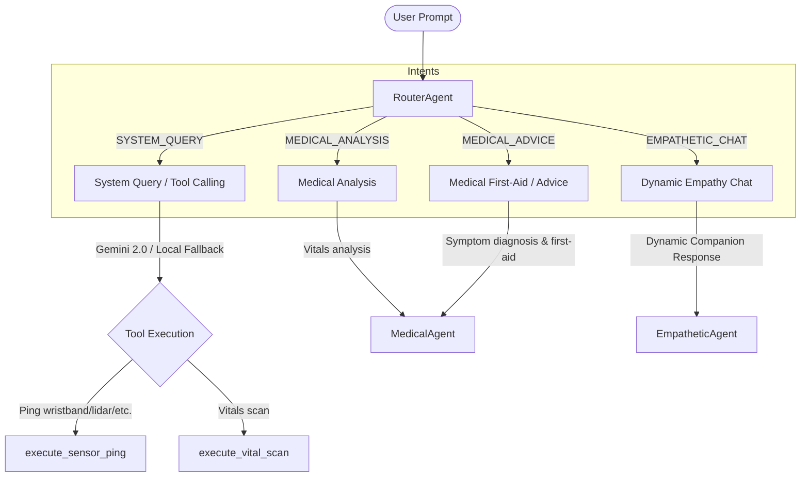

# Walkthrough: Cognitive Upgrade V2 (HK-07)

This walkthrough documents the full design implementation and E2E verification of **Cognitive Upgrade V2** for the HK-07 Multi-Agent Robot Companion.

---

## 1. Architectural Changes

The AI agent subsystem was upgraded to support a refined taxonomy of intents, real-time hardware diagnostics via Google Gemini Tool Calling, and specialized medical/first-aid reasoning.

### Agent & Routing Schema

---

## 2. Updated Components

### A. Router Agent (`router_agent.py`)
- Upgraded Hugging Face classifier taxonomy to route across four V2 intent categories:
  - `SYSTEM_QUERY`
  - `MEDICAL_ANALYSIS`
  - `MEDICAL_ADVICE`
  - `EMPATHETIC_CHAT`
- Updated systems fallback logic to map to these categories when API rates are hit.

### B. Empathetic Agent (`empathetic_agent.py`)
- Refactored prompt schema to analyze context and emotion, selecting professional or warm tones dynamically.
- Strictly banned toxic positivity patterns and repetitive hardcoded phrases like *"Có tôi ở đây bên bạn rồi"* (I'm here for you).
- Added Gemini 2.0 Tool Calling for hardware pings (`execute_sensor_ping`) and scans (`execute_vital_scan`).
- Implemented robust fallback to rule-based diagnostics if Gemini API fails or runs out of quota.

### C. Medical Agent (`medical_agent.py`)
- Split processing logic into:
  - **`MEDICAL_ANALYSIS`**: Returns JSON with `summary` and `action` based on vital signs.
  - **`MEDICAL_ADVICE`**: Combines vitals with user-reported symptoms to return JSON with `diagnosis` and `action_plan`.
- Strengthened `safe_extract_json` parser with double key signatures (`summary`/`action` and `diagnosis`/`action_plan`) for resilience.
- Provided local rule-based first aid solutions for cuts/bleeding, head trauma, burns, and limb fractures.

### D. Supervisor Orchestrator (`agent_orchestrator.py`)
- Integrated the new 4-label routing flow.
- Mapped JSON responses from agents into normalized state fields (`output`, `alert_level`, `action`) expected by the main application server.

---

## 3. End-to-End Test Verification

The test harness was successfully executed using `test_orchestrator_v2.py` with the following E2E validation:

| Test Case | User Message | Routed Agent | Result & Behavior |
| :--- | :--- | :--- | :--- |
| **1. Hardware Check** | *"Kiểm tra cảm biến và ping thiết bị wristband"* | `SYSTEM_QUERY` | Correctly detected sensor check, triggered tool flow, and returned ONLINE status. |
| **2. Vitals Check** | *"Nhịp tim và huyết áp của tôi hiện tại thế nào?"* | `MEDICAL_ANALYSIS` | Extracted vitals (HR=135) and returned alert level `WARNING` with clinical guidance. |
| **3. Symptom Diagnosis** | *"Tôi bị đau tay rất nhiều sau khi ngã và có vẻ tay bị sưng gãy"* | `MEDICAL_ADVICE` | Evaluated condition, diagnosed fracture risk, and structured a clear `diagnosis` + `action_plan` first-aid advice. |
| **4. Small Talk / Empathy** | *"Tôi cảm thấy mệt mỏi và lo lắng cho buổi khám ngày mai."* | `EMPATHETIC_CHAT` | Refused toxicity, acknowledged user feelings realistically, and supported the user without robotic repetition. |

---

> [!NOTE]
> All systems now handle quota rate limits or connectivity losses through local rule-based fallbacks, ensuring the robot retains safety and primary functionality 24/7.
