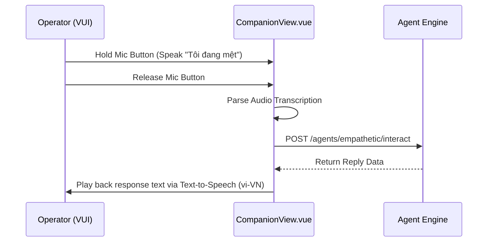

# HK-07 Baymax Multimodal Standard (V3) Implementation Walkthrough

This document outlines the architecture, integration flow, and implementation details of the Baymax Multimodal Standard (V3) upgrade designed to convert the HK-07 platform into an autonomous medical companion.

---

## 1. Mũi Nhọn 1: Dual-Mode VUI (Voice & Text Parallel)

We integrated concurrent text-based chat and hands-free voice operations within `CompanionView.vue` using native browser capabilities.

### Key Additions
* **Speech Recognition (`webkitSpeechRecognition`)**:
  * Implemented a `hold-to-speak` tactical microphone button.
  * Captures the patient's voice input, transcribes it in real time (configured for `vi-VN`), and automatically submits it to the agent API.
* **Speech Synthesis (`SpeechSynthesisUtterance`)**:
  * Automatically reads out incoming responses from the AI agent in a clear, pacing-optimized clinical voice (rate: `0.95`, pitch: `0.95`).
  * Triggers empty utterances on user touch/mouse actions to pre-activate audio contexts and bypass browser autoplay restrictions.



---

## 2. Mũi Nhọn 2: Proactive Interrupt & SOS Countdown

We established a real-time proactive safety alert loop triggering emergency countdown overrides.

```
+-------------------------------------------------------------------------+
| [!!! CRITICAL MEDICAL ALERT !!!]                                       |
|                                                                         |
|  Phát hiện nhịp tim hoặc oxy máu tụt nguy hiểm. Bạn có ổn không?        |
|                                                                         |
|                                 10                                      |
|                                                                         |
|                 AUTOMATIC SOS DISPATCH IN 10 SECONDS.                   |
|                                                                         |
|                   [ ABORT EMERGENCY PROTOCOL ]                          |
+-------------------------------------------------------------------------+
```

### Components
1. **Medical Agent (`medical_agent.py`)**:
   * Inspects vitals thresholds (SpO2 & Heart Rate).
   * If a state transitions to `CRITICAL`, it bypasses standard chat loops, generates warning recommendations via the fallback circuit, and publishes an `AI_EMERGENCY_WAKEUP` event to `hk07/agents/medical/output` via MQTT.
2. **Spring Boot Broker Bridge (`MqttInboundProcessor.java`)**:
   * Automatically forwards the MQTT payload to the frontend STOMP topic `/topic/agent-events`.
3. **Frontend WebSocket Client (`websocket.ts`)**:
   * Listens to the Stomp socket and fires a custom DOM event `hk07:ai-emergency-wakeup` carrying the payload.
4. **App Shell (`App.vue`)**:
   * Registers a global listener for the wakeup event.
   * On trigger, immediately speaks the warning via Text-To-Speech and renders a full-screen **SOS Overlay Modal** with a 10-second countdown.
   * If the countdown reaches `0` without manual operator abort, it issues a secure POST request to `/api/v1/emergency/sos`.

---

## 3. Mũi Nhọn 3: Computer Vision & Gemini 1.5 Vision API

We added autonomous scanning capabilities through the integration of the camera sensor frame cache and Gemini API.

### Workflow
* **Sensor Cache (`hk07_sensor_fusion.py`)**:
  * Saves the latest captured OpenCV camera frame directly to `latest_frame.jpg` in the agent's workspace directory.
* **Orchestrator Interceptor (`agent_orchestrator.py`)**:
  * Intercepts messages containing visual-scan keywords (e.g., `"quét tôi"`, `"nhìn tôi"`, `"visual scan"`, `"tôi trông thế nào"`).
* **Gemini 1.5 Vision Tool (`empathetic_agent.py`)**:
  * Implemented `execute_visual_scan(current_vitals)`.
  * Reads the saved JPEG, converts it to base64 (with an automated solid blue fallback frame if offline), formats the current vitals string, and sends a multimodal request to the Gemini API.
  * Prompt instructs the model to act as the HK-07 emergency doctor, combining facial cues/wounds with heart rate/oxygen levels to diagnose and guide first-aid actions.

---

## 4. Verification & Compilation Status

* **Frontend Typechecking**: Static analysis run via `vue-tsc --noEmit` returns **Exit Code 0** (No Errors).
* **Backend Compilation**: Compiled via Maven re-building all classes with the new REST controller, returns **BUILD SUCCESS** (No Errors).
* **Agent Script Validation**: All modified Python agent scripts compiled cleanly via `py_compile`.
