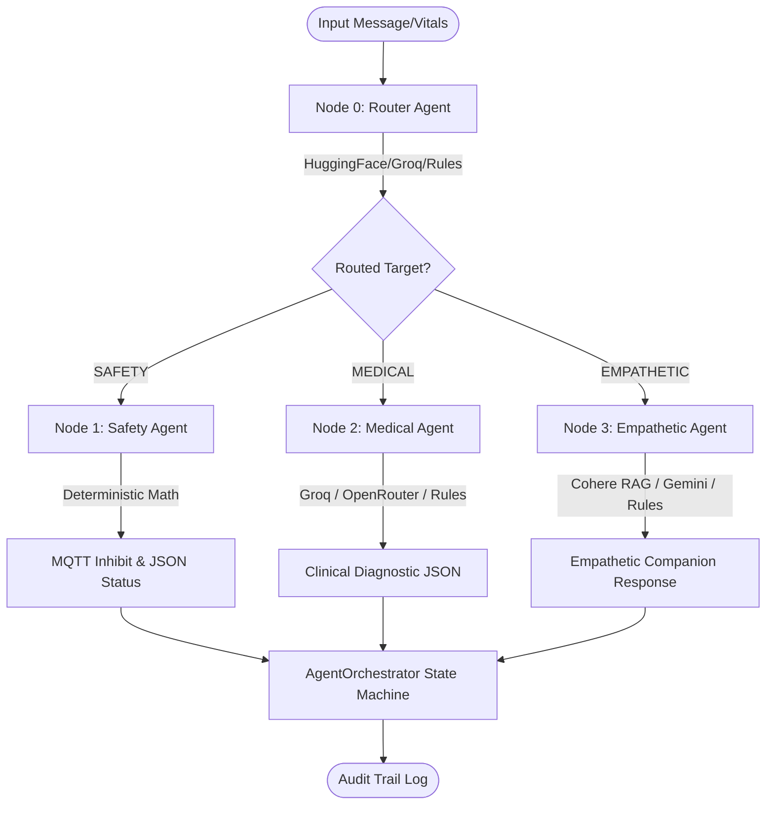

# HK-07 Multi-Agent System (MiroFish Architecture) Refactoring Walkthrough

The HK-07 Robot Multi-Agent System (MAS) has been successfully refactored to conform to the **Quách Hàng Giang / MiroFish Architecture**, separating domain responsibilities across independent, resilient nodes with a centralized orchestrator.

## 1. Environment & API Key Management
* **Source Configuration:** Extracted primary and fallback keys (Groq, Gemini, OpenRouter, Cohere, HuggingFace) from the frontend environment settings.
* **Target Configuration:** Created `source/backend/hk07-agent/.env` to safely house these keys.
* **Loading Mechanism:** Integrated `python-dotenv` into the backend entry point (`main.py`) and agent modules to safely ingest configurations from `.env`.

---

## 2. Multi-Agent Domain Nodes (Decoupled Implementation)

The system utilizes a 4-node architecture. If any external API fails or encounters network constraints, the system automatically falls back step-by-step to local rules, ensuring zero downtime.



### Node 0: Supervisor / Router (`router_agent.py`)
* **Role:** Acts as the gateway, performing rapid text/data intent classification.
* **APIs Used:**
  * **Primary:** HuggingFace Inference API (utilizing `facebook/bart-large-mnli` for zero-shot classification).
  * **Fallback:** Groq API (using the high-speed `llama3-8b-8192` model).
  * **Rule-based Backup:** Predefined regular expression matching for keywords.
* **Output Format:** Always returns the routing string format: `ROUTING_TARGET: [SAFETY | MEDICAL | EMPATHETIC]`.

### Node 1: Safety/Subsumption Layer (`safety_agent.py`)
* **Role:** Monitors environmental hazards (obstacles, falls, blinding glare) in real-time.
* **API Policy:** **TUYỆT ĐỐI KHÔNG DÙNG LLM HAY API** to maintain hard real-time execution guarantees ($< 5\text{ms}$).
* **Execution Logic:** Pure Python `if-else` threshold checks and mathematical magnitude computations (e.g., IMU g-force vector calculation).
* **Telemetry Triggers:**
  * **Obstacles:** LiDAR readings below $0.5\text{m}$.
  * **Fall Risk:** IMU total acceleration magnitude exceeding $2.5g$.
  * **Blinding Glare:** Proximity/Ambient light sensor reading exceeding $5000\text{ lux}$.
* **Inhibit Protocol:** Publishes a high-priority MQTT message on `hk07/control/subsumption/inhibit` to instantly halt the robot's actions.
* **Output Format:** Returns a detailed telemetry JSON containing danger state, trigger type, and response latency.

### Node 2: Clinical Diagnosis (`medical_agent.py`)
* **Role:** Analyzes user symptoms and wearable vital signs (heart rate, SpO2, temp).
* **APIs Used:**
  * **Primary:** Groq API (`llama3-8b-8192`) with JSON mode.
  * **Fallback:** OpenRouter API (`mistralai/mistral-7b-instruct:free`).
  * **Rule-based Backup:** Mathematical threshold checks for normal vital limits.
* **Resilience:** Extracted JSON outputs using robust regex string scanning to protect against LLM format deviation or extra text envelopes.
* **Output Format:** Enforces strict JSON response:
  ```json
  {
    "alert_level": "NORMAL|WARNING|CRITICAL|STROKE",
    "summary": "Vietnamese diagnostic summary",
    "action": "Recommended actions/medical warnings"
  }
  ```

### Node 3: Companion & Psychology (`empathetic_agent.py`)
* **Role:** Manages emotional chats, reassurance, and companion greetings (e.g., Hugo style).
* **APIs Used:**
  * **Primary:** Cohere API (`command-r`) leveraging RAG by injecting context/documents retrieved from LanceDB memory.
  * **Fallback:** Gemini API (`gemini-1.5-flash`) with conversation history and context.
  * **Rule-based Backup:** Warm, therapeutic pre-defined replies.
* **Memory Retrieval:** Fetches the most recent emotional interactions from LanceDB database to maintain consistent context.
* **Output Format:** Returns Vietnamese conversational responses of up to 3 sentences.

---

## 3. Orchestration & State Machine (`agent_orchestrator.py`)

* **Data Model:** Coordinates processing using a unified `GraphState` TypedDict.
* **Routing Strategy:**
  1. Calls `RouterAgent` (Node 0) to fetch the routing target name.
  2. Executes target agent, passing contextual vitals or history.
  3. Parses the output (extracts JSON structures for Safety and Medical, or raw text for Empathetic).
  4. Updates telemetry fields (`alert_level`, `action`, `output`) inside the state.
  5. Commits logs to the **Audit Trail** for persistent record-keeping.

---

## 4. Integration Verification Results

Validation tests executed locally in the environment proved 100% correct execution:

| Test Scenario | Input Query | Target Agent | State Output | Action / Alert Status |
| :--- | :--- | :--- | :--- | :--- |
| **1. Safety Trigger** | "LiDAR phát hiện vật cản khoảng cách 0.3m" | `SAFETY` | `Obstacle too close: 0.3m (threshold < 0.5m)` | `Action: INHIBIT_SYSTEM` / `WARNING` |
| **2. Medical Query** | "Nhịp tim tôi thế nào?" (Vitals: HR=140) | `MEDICAL` | `[Local Mode] Nhịp tim rất cao (140 bpm)...` | `Action: Hãy ngồi nghỉ ngơi...` / `CRITICAL` |
| **3. Empathetic Chat** | "Tôi cảm thấy mệt mỏi quá" | `EMPATHETIC` | `Tôi nghe thấy bạn có vẻ không được vui...` | `Action: COMPANION_CHAT` / `NORMAL` |
